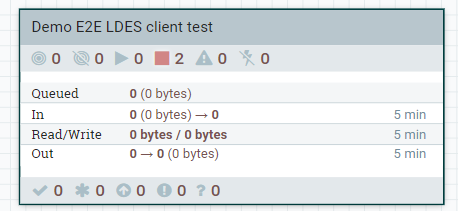

# Demo 1 - May, 24th 2022

This test demonstrates user story **As a data intermediary I want to replicate the GIPOD LDES data set** (VSDSPUB-59).

> **Note**: Currently, you can only perform the LDES client E2E test manually because in the automated test Apache NiFi refuses any REST API call, even when passing a valid JWT token. We are investigation the problem (security related) and will add the automated test as soon as we got this resolved.

This LDES client E2E test is essentially really simple: we use a [GIPOD simulator](../../ldes-server-simulator/README.md) which serves a subset of the original GIPOD data set, an Apache NiFi instance containing the LDES client NiFi processor and, a small http-server which serves as a [sink](../../ldes-client-sink/README.md) that allows to capture the LDES members emitted by the LDES client NiFi processor.

C4 diagrams:


To run the E2E test manually, you need to:
1. Start the docker containers containing the GIPOD simulator, the Apache NiFi instance and the sink http-server.
2. Verify that all the containers are correctly started.
3. Upload a pre-defined NiFi workflow containing the LDES client processor and a InvokeHTTP processor (to send the LDES members to the sink).
4. Start the NiFi workflow and wait for it to process all LDES members.
5. Verify that all LDES members from the GIPOD simulator are received by the sink http-server.
6. Stop the docker containers.

## Start docker containers

> **Note**: currently, we do not create and push artifacts to external repositories such as Maven central and Docker Hub so we need to build all the systems from code. Therefore, before building and running the simulator, sink and client demo (empty Apache NiFi) systems, please retrieve the source code repositories at the time before the demo (open a terminal at the location of this file and execute these commands):
> ```bash
> cd ../../../VSDS-LDESClient-NifiProcessor/
> git switch main
> git pull
> git checkout `git rev-list -n 1 --before="2022-05-24 09:30 +02:00" main`
> cd ../VSDS-LDES-E2E-testing/e2e-test/20220425.demo-1/
> git switch main
> git pull
> git checkout `git rev-list -n 1 --before="2022-06-04 00:00 +02:00" main` #Note: we moved the E2E tests and needed to redo the support files
>```

To start the docker containers, you need to use the `docker compose` command. This command will use the [docker-compose.yml](./docker-compose.yml) file found in this directory. It will also use a [.env](./.env) file containing environment variables passed to the docker containers when run. Before the Apache NifI container can be started you need to provide the single user credentials used for logging on to the Nifi instance. You can do this by editing this [.env](./.env) file and filling in the variables for the username and password. 

> **Note**: if you leave the credentials empty, Apache NiFI will generated random user credentials. The [docker-compose.yml](./docker-compose.yml) file includes configuration to map the NiFi logs and conf directory to the host system, allowing to inspect these files. You can find the generated credentials in the [Nifi application log file](./nifi/logs/nifi-app.log).

To start all docker containers, you need to execute the following shell commands in a terminal:
```bash
docker compose up
```

This will build the docker images if not available and then run them with the given environment variables. All container output will be shown interactively (for diagnostic purposes).

Alternatively, you can provide a different file containing environment variables (including your credentials) by using the `--env-file` option. E.g.:
```bash
docker compose --env-file <your-env-file-location-and-name> up
```

## Verify docker containers are started

The GIPOD simulator and sink http-server are both a small http-server which are both almost directly available. You can use the following links in your browser or your favorite http-client tool to verify they started correctly:
* GIPOD simulator: http://localhost:9001/
* sink http-server: http://localhost:9003/

The Apache NiFi server needs a couple of minutes to start.

Once started, you can find the NiFi user interface at https://localhost:8443/nifi.

## Upload NiFi workflow

In order to upload the NiFi workflow you first need to log on to the [Apache NiFi user interface](https://localhost:8443/nifi) using the user credentials provided in the `.env` file (or the alternative file passed in by `--env-file`).

Once logged in, you need to create a new process group based on a [pre-defined workflow](./data/replicate.nifi-workflow.json) (containing a LDES client and a InvokeHTTP processor):
* drag-n-drop the process group icon on the NiFi workpace:


* enter the process group name, browse to the pre-defined workflow, select it and confirm the add action

 

* verify that the workflow is added, open it by double-clicking its title bar and verify that the workflow contains the two processors

  

## Start the workflow

You can verify the LDES client processor properties to ensure the input source is the GIPOD simulator and the sink properties to ensure that the InvokeHTTP processor POSTs the LDES members to the sink http-server.

 

To launch the workflow, ensure that no processor is selected (click in the workpace OR navigate back to the root process group and select the newly added process group) and click the start button.

 

## Verify LDES members received

The GIPOD simulator is seeded by a subset of the GIPOD dataset containing five fragments of which the first four fragments contain 250 members each and the last one contains 16 members, making a total of 1016 LDES members served.

You can verify that, after some time, all LDES members are received by the sink http-server by visit the following pages: http://localhost:9003 (count) and http://localhost:9003/member (LDES member IDs).

## Stop docker containers

To start all docker containers, you need to execute the following shell commands in a terminal:
```bash
docker compose down
```

This will gracefully shutdown all containers used in the E2E test.
