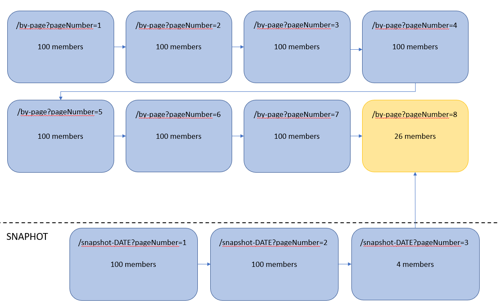

# LDES Server Can Fragment an LDES Using Simple Pagination

This test validates user story **As a Publisher, I want to serve a snapshot of a view where no snapshot exists for yet
to consumers, so I can facilitate that consumers need to replicate less** (VSDSPUB-564) and was shown during demo on
April, 11th 2023.

## Scenario: Small Dataset

This scenario verifies that the LDES server creates a snapshot.

```gherkin
  Scenario: Create a snapshot using the LDES server
Given An LDES server with the defaultView enabled
And I have ingested a series of tree members
When I create a snapshot via the admin api by making a post request on '/admin/api/v1/snapshots'
Then the snapshot is created
And the snapshot contains only the latest version of every resource
And the snapshot has a relation to the mutable tree node of the default view
And the snapshot is saved in the database
And the snapshot can be retrieved as an LDES stream
```

### Test Setup

For all these scenarios we use a [custom context](./docker-compose.yml).

Then you can run the systems by executing the following command:

```bash
cd e2e-test/demos/ldes-server-snapshot/
docker compose up -d
```

> **Note**: it may take a minute for the LDES Server to start.

Ingest all the members by executing the following script:

```bash
sh ingest_script.sh
```

### Test Execution

For testing the creation of a snapshot we need to send a post request to the server

```bash
curl -X POST http://localhost:8080/admin/api/v1/snapshots
```

Now you can verify in the database (for example using MongoDBCompass) that there's a new collection `snapshot`. And that
this collection contains one document (the snapshot you just created).
In the collection `ldesfragment` you will see additional fragments which are part of the snapshot view.

#### Small dataset

If you have chosen to use the small dataset in the ingest script `ingest_script.sh`, then 11 members will be ingested in
the server. These members are all version objects of three resources.
A schematic overview of the members is given in the following figure:


When a snapshot is created, only the latest version objects are kept in the snapshot. In this case the snapshot contains
thus three members:

* https://test-data/mobility-hindrance/1/2
* https://test-data/mobility-hindrance/2/4
* https://test-data/mobility-hindrance/3/5

Since the dataset is relatively small, the original steam only has one fragment.
The snapshot in this case will have a link towards this mutable fragment. In the section we'll see the advantage of
snapshots in larger datasets.

#### Medium dataset

In the medium dataset there are 726 version objects of 204 resources.
When we create a snapshot of this dataset, only the latest version objects of the 204 resources will be in the snapshot.
The last tree node of the snapshot will point towards the mutable tree node of the default view, in this case: `/by-page?pageNumber=8`. A schematic overview is given below:


### Test Teardown

Stop all the systems using the following command:

```bash
docker compose down
```
