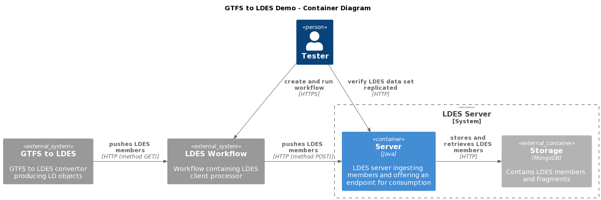

# GTFS2LDES-js / Workflow / Server / Mongo Context
This context is used for validating the LDES server for the GTFS use case.

This context is based on a [GTFS to LDES convertor (JavaScript variant)](https://github.com/julianrojas87/gtfs2ldes-js) which produces a data set of connections as linked data (LD) objects starting from a GTFS data set and from the GTFS real-time (GTFS/RT) updates.

We use an Apache NiFi instance which should be configured with a workflow containing a standard ListenHTTP processor to listen to the generated LD objects being POSTed and forward these via a queue to a standard InvokeHTTP processor to the LDES server, which stores the data set in a MongoDB.

If required, the workflow can contain other processors to transfor the LD object as needed. Alternatively, custom processors can also be provided to listen to the GTFS2LDES system and/or POST to the LDES server.

## Setup the Context
To setup the context, combine the contents of all the `<component>.env` files into an `user.env` and specify the missing, required arguments:
* SINGLE_USER_CREDENTIALS_USERNAME (Apache NiFi single user credentials - user name)
* SINGLE_USER_CREDENTIALS_PASSWORD (Apache NiFi single user credentials - password)
* SPRING_DATA_MONGODB_DATABASE (e.g. `DeLijn`)
* MONGODB_DATA_FOLDER (location of MongoDB permanent storage, no default)
* GTFS_BASE_IRI with trailing `/` (e.g. `https://data.delijn.be/`)

Optionally, you can also specify different (external) port numbers for the components and other overridable variables:
* NIFI_TAG (default: `1.17.0-jdk17`)
* NIFI_JVM_HEAP_INIT (initial JVM heap size, default: `2g`)
* NIFI_JVM_HEAP_MAX (max JVM heap size, default: `4g`)
* NIFI_UI_PORT (default: `8443`)
* NIFI_WORKFLOW_LISTEN_PORT (port the ListenHTTP processor listens for GTFS members, default: `9005`)
* LDES_SERVER_TAG (default: `20230112t1553`)
* LDES_COLLECTIONNAME (default `connections`)
* LDES_MEMBERTYPE (default: `http://semweb.mmlab.be/ns/linkedconnections#Connection`)
* LDES_SERVER_PORT (default: 8080)
* LDES_SHAPE (optional, shape of ingested members, no default)
* VIEW_TIMESTAMPPATH (default: `http://www.w3.org/ns/prov#generatedAtTime`)
* VIEW_VERSIONOFPATH (default: `http://purl.org/dc/terms/isVersionOf`)
* VIEWS_0_NAME (default: `by-time`)
* VIEWS_0_FRAGMENTATIONS_0_CONFIG_MEMBERLIMIT (number of members per fragment, default: `100`)
* MONGODB_TAG (default: `6.0.3`)
* MONGODB_PORT (default: `27017`)

In addition, for the GTFS to LDES conversion, various other arguments are required (for more information see [here](https://github.com/julianrojas87/gtfs2ldes-js)):
* GTFS_SOURCE (static GTFS file container path or URL, no default)
* GTFSRT_SOURCE (GTFS/RT URL, no default)
* GTFS2LDES_DATA_FOLDER (location of GTFS data permanent storage, no default)

Optionally, you can currently tune the following parameters: 
* GTFS2LDES_TAG (default: `20230129t1743`)
* RUN_ON_LAUNCH (`true` or `false`, default: `true`)
* THROTTLE_RATE (default: 10)
* GTFS_CRON (cron for reading GTFS source, default: `0 0 3 1 * *`)
* GTFSRT_CRON (cron for reading GTFS/RT source, default: `*/30 * * * * *`)
* AUTH_HEADER (optional, authentication type for requesting GTFS/RT, no default)
* AUTH_HEADER_VALUE (optional, authentication value for requesting GTFS/RT, no default)

## Run the Systems
To create and start all systems in the context:
```bash
docker compose --env-file user.env up
```

> **Note**: the GTFS to LDES convertor is configured to not start immediately (tagged with a profile) because currently we cannot automatically upload the workflow to the Apache NiFi system. Therefore, you need to start the GTFS to LDES convertor, manually after loading and starting the workflow.

### Start the GTFS to LDES convertor
To start the GTFS to LDES convertor (after running the workflow) use the following Bash command:
```bash
docker compose --env-file user.env up gtfs2ldes-js
```

## Verify Context
To verify that all systems in the context are available (please subsitute the correct ports if changed):

### GTFS to LDES convertor
Please check the Docker logs for the status.

### LDES Client Workflow
The Apache NiFi server needs a couple of minutes to start. Use your favorite browser to connect to the Apache NiFi User Interface at https://localhost:8443/nifi/login and use your credentials to login.

### LDES Server
Browse to `http://localhost:8080/<ldes-view-name>` (e.g. http://localhost:8080/connections/by-time) or run an equivalent Bash command, e.g.:
```bash
curl http://localhost:8080/connections/by-time
```

### Mongo Database
Browse to http://localhost:27017 or use Bash command:
```bash
curl http://localhost:27017
```
response:
```text
It looks like you are trying to access MongoDB over HTTP on the native driver port.
```
This means that the MongoDB is correctly started. To actually view the contents of the database, use a Mongo command line tool or GUI, e.g. [Compass](https://www.mongodb.com/products/compass).

### Stop the Systems
To stop all systems in the context:
```bash
docker compose down
docker compose --profile delay-started down
```
This will gracefully shutdown all systems in the context and remove them.

## C4 Diagrams

### Context


### Container


### Component

