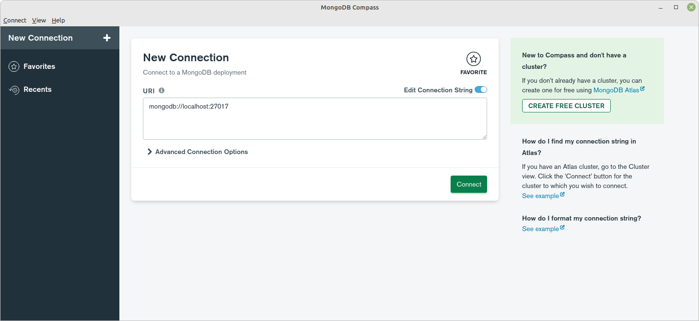
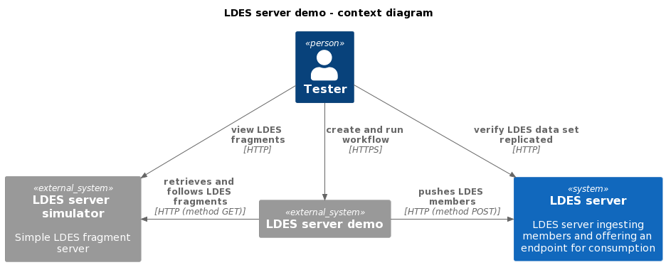
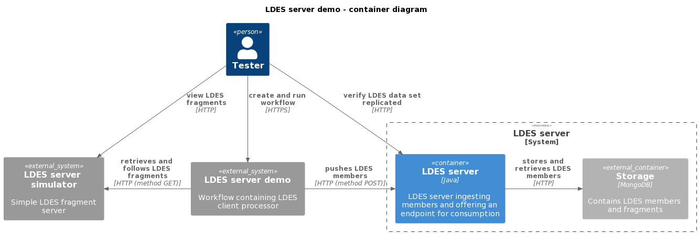
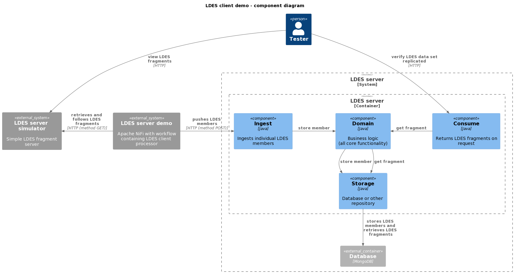

# Simulator / Workflow / Server / Mongo Context
This context is used for validating the LDES server.

We use an [LDES Server Simulator](/ldes-server-simulator/README.md) which serves (a subset of) a data set (e.g. alternative for GIPOD LDES server which contains too much data), an Apache NiFi instance containing the LDES client NiFi processor and the LDES server configured to capture the LDES members emitted by the LDES client NiFi processor.

## Setup the Context
To setup the context, combine the contents of all the `env.<component>` files into an `env.user` and specify the missing, required arguments:
* LDES_SERVER_SIMULATOR_TAG (e.g. `20220718T1542`)
* LDES_WORKBENCH_NIFI_TAG (e.g. `20220901t170424`)
* SINGLE_USER_CREDENTIALS_USERNAME (Apache NiFi single user credentials - user name)
* SINGLE_USER_CREDENTIALS_PASSWORD (Apache NiFi single user credentials - password)
* LDES_SERVER_TAG (e.g. `20220721t0939`)
* LDES_COLLECTIONNAME (e.g. `"mobility-hindrances"`)
* LDES_MEMBERTYPE (e.g. `"https://data.vlaanderen.be/ns/mobiliteit#Mobiliteitshinder"`)

Optionally, you can also specify different (external) port numbers for the components and other overridable variables:
* USECASE_NAME (default: `simulator-workflow-server-mongo`)
* LDES_SERVER_SIMULATOR_PORT (default: `9011`)
* NIFI_UI_PORT (default: `8443`)
* LDES_SERVER_SIMULATOR_SEED_FOLDER (an empty data folder, so no seeding)
* LDES_SHAPE (shape of ingested members, no default)
* VIEW_TIMESTAMPPATH (e.g. `"http://www.w3.org/ns/prov#generatedAtTime"`)
* VIEW_VERSIONOFPATH (e;g. `"http://purl.org/dc/terms/isVersionOf"`)
* TIMEBASED_MEMBERLIMIT (number of members per fragment, default: `100`)
* MONGODB_TAG (default: `5.0.11`)
* MONGODB_PORT (default: `27017`)

### Geospatial Fragmentation

> **Note**: as of tag `20220812T1227`, the LDES Server allows to choose between time-based and geospation fragmentation.

The default fragmentation is time-based and its only property is still TIMEBASED_MEMBERLIMIT. To change this default fragmentation type to geospatial fragmentation set the FRAGMENTATION_TYPE:
* FRAGMENTATION_TYPE (`timebased` or `geospatial`, default: `timebased`)

and configure the geospatial fragmentation:

* GEOSPATIAL_MAXZOOMLEVEL (the required [zoom level](https://wiki.openstreetmap.org/wiki/Zoom_levels), no default)
* GEOSPATIAL_BUCKETISERPROPERTY (defines which property will be used for bucketizing, e.g. `"http://www.opengis.net/ont/geosparql#asWKT"`)
* GEOSPATIAL_PROJECTION (the projection type, currently only `lambert72` is allowed)

### Multi-level Fragmentation

> **Note**: as of tag `20220826t1001`, the LDES Server allows to define a multi-level fragmentation strategy.

The property `FRAGMENTATION_TYPE` has been replaced by `FRAGMENTATIONLIST_FRAGMENTATIONS` in which you can fill in the required fragmentation:
* `timebased`
* `geospatial`
* `geospatial,timebased`
* "" (leave empty results in no fragmentation)
* ... (other combinations of plugged in fragmentations)

### Multiview

> **Note**: as of tag `20220914t0740`, the LDES Server allows to define a multiple views, each based on a different fragmentation strategy.

The property `FRAGMENTATIONLIST_FRAGMENTATIONS` has been replaced by the following properties:
* VIEWS_X_NAME=name of the view
* VIEWS_X_FRAGMENTATIONS_Y_NAME=name of fragmentation (currently, only "timebased" and "geospatial" are supported)
* VIEWS_X_FRAGMENTATIONS_Y_CONFIG_`FRAGMENTATION_PROPERTY_KEY`=`FRAGMENTATION_PROPERTY_VALUE` (specific to the kind of fragmentation, e.g. `FRAGMENTATION_PROPERTY_KEY` = "maxzoomlevel" and `FRAGMENTATION_PROPERTY_VALUE` = "15" for geospatial fragmentation)

## Run the Systems
To create and start all systems in the context:
```bash
docker compose --env-file env.user up
```

## Verify Context
To verify that all systems in the context are available (please subsitute the correct ports if changed):

### LDES Server Simulator
Browse to http://localhost:9011 or run Bash command:
```bash
curl http://localhost:9011
```
response (if not seeded):
```json
{"aliases":[],"fragments":[]}
```

### LDES Client Workflow
The Apache NiFi server needs a couple of minutes to start. Use your favorite browser to connect to the Apache NiFi User Interface at https://localhost:8443/nifi/login and use your credentials to login.

### LDES Server
Browse to `http://localhost:8080/<ldes-collection-name>` (e.g. http://localhost:8080/mobility-hindrances) or run an equivalent Bash command, e.g.:
```bash
curl http://localhost:8080/mobility-hindrances
```
response will be similar to:
```json
{
  "@id": "http://ldes-server:8080/mobility-hindrances",
  "@type": "https://w3id.org/ldes#EventStream",
  "https://w3id.org/ldes#timestampPath": {
    "@id": "http://www.w3.org/ns/prov#generatedAtTime"
  },
  "https://w3id.org/ldes#versionOf": {
    "@id": "http://purl.org/dc/terms/isVersionOf"
  },
  "https://w3id.org/tree#shape": {
    "@id": "https://private-api.gipod.test-vlaanderen.be/api/v1/ldes/mobility-hindrances/shape"
  }
}
```

### Mongo Database
Browse to http://localhost:27017 or use Bash command:
```bash
curl http://localhost:27017
```
response:
```text
It looks like you are trying to access MongoDB over HTTP on the native driver port.
```
This means that the MongoDB is correctly started. To actually view the contents of the database, use a Mongo command line tool or GUI, e.g. [Compass](https://www.mongodb.com/products/compass).


### Stop the Systems
To stop all systems in the context:
```bash
docker compose down
```
This will gracefully shutdown all systems in the context and remove them.

## C4 Diagrams

### Context


### Container


### Component

