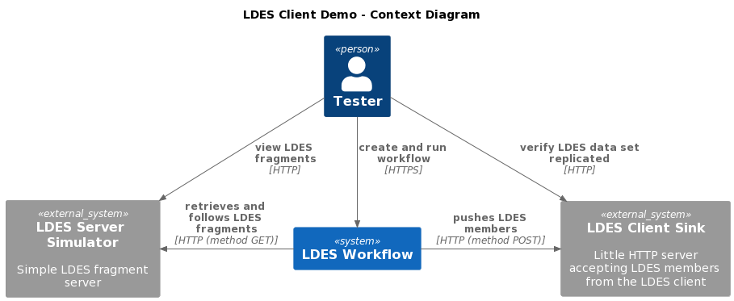

# Simulator / Workflow / Sink / Mongo Context
This context is used for validating the LDES client.

We use an [LDES Server Simulator](/ldes-server-simulator/README.md) which serves (a subset of) a data set (e.g. alternative for GIPOD LDES server which contains too much data), an Apache NiFi instance containing the LDES client NiFi processor and, a small HTTP server which serves as a [sink](/ldes-client-sink/README.md) that allows to capture the LDES members emitted by the LDES client NiFi processor.

## Setup the Context
If needed, copy the [environment file (.env)](./.env) to a personal file (e.g. `user.env`) and change the settings as needed. If you do, you need to add ` --env-file user.env` to each `docker compose` command. You can specify different (external) port numbers for the components and other overridable variables:
* SINGLE_USER_CREDENTIALS_USERNAME (Apache NiFi single user credentials - user name, default: `e2etest`)
* SINGLE_USER_CREDENTIALS_PASSWORD (Apache NiFi single user credentials - password, default: `e2etest2022DEMO`)
* USECASE_NAME (default: `simulator-workflow-sink-mongo`)
* LDES_SERVER_SIMULATOR_TAG (default: `20230214t1503`)
* LDES_SERVER_SIMULATOR_PORT (default: `9011`)
* LDI_WORKBENCH_NIFI_TAG (default: `20230328t074157`)
* NIFI_UI_PORT (default: `8443`)
* LDES_CLIENT_SINK_TAG (default: `20230214t1503`)
* LDES_CLIENT_SINK_SILENT (default: `true`)
* LDES_CLIENT_SINK_MEMBER_TYPE (default: `https://data.vlaanderen.be/ns/mobiliteit#Mobiliteitshinder`)
* LDES_CLIENT_SINK_DATABASE_NAME (default: `GIPOD`)
* LDES_CLIENT_SINK_COLLECTION_NAME (default: `mobility-hindrances`)
* LDES_CLIENT_SINK_PORT (default: `9003`)
* MONGODB_TAG (default: `6.0.4`)
* MONGODB_PORT (default: `27017`)

## Run the Systems
To create and start all systems in the context:
```bash
docker compose up
```

## Verify Context
To verify that all systems in the context are available (please subsitute the correct ports if changed):

### LDES Server Simulator
Browse to http://localhost:9011 or run Bash command:
```bash
curl http://localhost:9011
```
response (if not seeded):
```json
{"aliases":[],"fragments":[]}
```

### LDES Client Workflow
The Apache NiFi server needs a couple of minutes to start. Use your favorite browser to connect to the Apache NiFi User Interface at https://localhost:8443/nifi/login and use your credentials to login.

### LDES Client Sink
Browse to http://localhost:9003 or run Bash command:
```bash
curl http://localhost:9003
```
response:
```json
{"count":0}
```

### Mongo Database
Browse to http://localhost:27017 or use Bash command:
```bash
curl http://localhost:27017
```
response:
```text
It looks like you are trying to access MongoDB over HTTP on the native driver port.
```
This means that the MongoDB is correctly started. To actually view the contents of the database, use a Mongo command line tool or GUI, e.g. [Compass](https://www.mongodb.com/products/compass).

## Stop the Systems
To stop all systems in the context:
```bash
docker compose down
```
This will gracefully shutdown all systems in the context and remove them.

## C4 Diagrams

### Context


### Container


### Component

