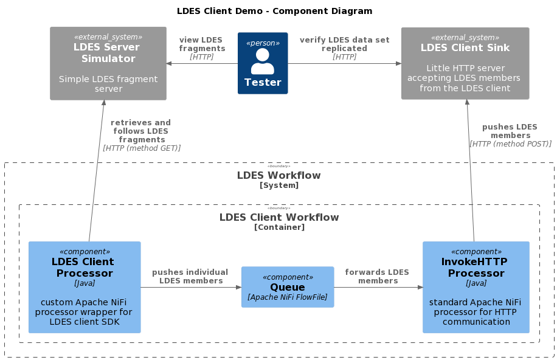

# Simulator / workflow / sink context
This context is used for validating the LDES client.

We use an [LDES server simulator](/ldes-server-simulator/README.md) which serves (a subset of) a data set (e.g. alternative for GIPOD LDES server which contains too much data), an Apache NiFi instance containing the LDES client NiFi processor and, a small http-server which serves as a [sink](/ldes-client-sink/README.md) that allows to capture the LDES members emitted by the LDES client NiFi processor.

## Setup the context
To setup the context, copy the [example docker environment file](./.env) to `env.user` and specify the required arguments:
* LDES_SERVER_SIMULATOR_TAG (e.g. 20220718T1542)
* LDES_CLIENT_NAR_TAG (e.g. 20220704.153332-11)
* LDES_CLIENT_SINK_TAG (e.g. 20220714T1423)
* PAT_READ_PACKAGES (Github personal access token)
* SINGLE_USER_CREDENTIALS_USERNAME (Apache NiFi single user credentials - user name)
* SINGLE_USER_CREDENTIALS_PASSWORD (Apache NiFi single user credentials - password)

> **Note**: you need to specify a [Github personal access token](https://docs.github.com/en/authentication/keeping-your-account-and-data-secure/creating-a-personal-access-token) (PAT) with scope `read:packages`

Optionally, you can also specify different tags for the system images and other artifacts, different port numbers, etc.:
* LDES_SERVER_SIMULATOR_PORT (default: 9011)
* LDES_CLIENT_SINK_PORT (default: 9003)
* NIFI_UI_PORT (default: 8443)
* LDES_SERVER_SIMULATOR_SEED_FOLDER (an empty data folder, so no seeding)

## Run the systems
To create and start all systems in the context:
```bash
docker compose --env-file env.user up
```

## Verify context
To verify that all systems in the context are available (please subsitute the correct ports if changed):

### LDES server simulator
Browse to http://localhost:9011 or run bash command:
```bash
curl http://localhost:9011
```
response:
```json
{"aliases":[],"fragments":[]}
```

### LDES client workflow
The Apache NiFi server needs a couple of minutes to start. Use your favorite browser to connect to the Apache NiFi User Interface at https://localhost:8443/nifi/login and use your credentials to login.

### LDES client sink
Browse to http://localhost:9003 or run bash command:
```bash
curl http://localhost:9003
```
response:
```json
{"count":0}
```

### Stop the systems
To stop all systems in the context:
```bash
docker compose down
```
This will gracefully shutdown all systems in the context and remove them.

## C4 diagrams

### Context


### Container


### Component

