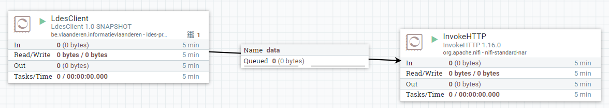

# Apache NiFi Workflow Context
The LDES client is currently provided as a Apache NiFi processor and therefore requires an Apache NiFi system hosting a Apache NiFi workflow.

This context is used for validating the LDES client and other custom-built NiFi processors.

## Setup the Context
To setup the context, copy the `.env` file into an `user.env` and specify the missing, required arguments:
* NIFI_DATA_FOLDER (e.g.: `~/data/my-use-case`)

Optionally, you can also specify different (external) port numbers for the components and other overridable variables:
* SINGLE_USER_CREDENTIALS_USERNAME (Apache NiFi single user credentials - user name, default: `e2etest`)
* SINGLE_USER_CREDENTIALS_PASSWORD (Apache NiFi single user credentials - password, default: `e2etest2022DEMO`)
* USECASE_NAME (default: `workflow`)
* NIFI_UI_PORT (default: `8000`)
* NIFI_WORKFLOW_LISTEN_PORT (default: `9005`)

## Run the System
To create and start the workflow container:
```bash
docker compose --env-file user.env up
```

## Logon to the Apache NiFi System
In order to logon, point your favorite browser to https://localhost:8443/nifi/login and provide your credentials specified when running the Docker image.

## Creating a Workflow
In order to create a workflow based on a predefined workflow definition, you need to:
* drag-n-drop the process group icon on the NiFi workpace:


* enter the process group name, browse to the pre-defined workflow definition, select it and confirm the add action

 

* verify that the workflow is added, open it by double-clicking its title bar and verify the workflow contents

  

## Starting a Workflow
To launch a workflow, ensure that no processor is selected (click in the workpace OR navigate back to the root process group and select the newly added process group) and click the start button.

 

## Stopping a Workflow
To stop a workflow, ensure that no processor is selected (click in the workpace OR navigate back to the root process group and select the newly added process group) and click the stop button (immediately to the right of the start button).

## Stop the System
To stop and remove the workflow container:
```bash
docker compose --env-file user.env down
```
This will gracefully shutdown the workflow system and remove the container.
