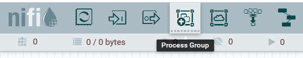
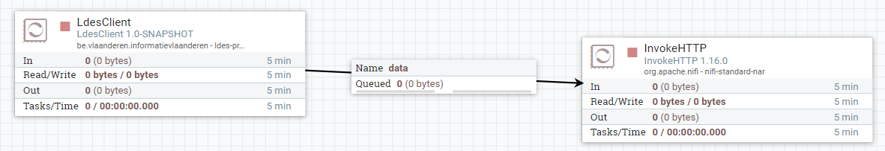

# Apache NiFi Workflow
The LDES client is currently provided as a Apache NiFi processor and therefore requires an Apache NiFi system hosting a Apache NiFi workflow.

The [Docker file](./Dockerfile) allows to create a container for Apache NiFi without a NiFi workflow but containing an LDES client processor. It requires the following build arguments:
* PAT_READ_PACKAGES ([Github personal access token](https://docs.github.com/en/authentication/keeping-your-account-and-data-secure/creating-a-personal-access-token) (PAT) with scope `read:packages`)
* LDES_CLIENT_NAR_TAG (LDES client tag specifying the specific version to deploy in the Apache NiFi environment)
* AGTURLEY_NIFI_TAG (Apache NiFi base image, defaults currently to `1.16.3-jdk17`)

These build arguments can be specified on the command line when building the Docker image or as part of a Docker compose file. E.g.
```bash
docker build --build-arg PAT_READ_PACKAGES=ghp_your_pat_here --build-arg LDES_CLIENT_NAR_TAG=20220704.153332-11 --tag example/workflow .
```

## Run the Apache NiFi System (Standalone)
To start the container image standalone run the `docker run` command. E.g.:
```bash
docker run -p 8443:8443 --env SINGLE_USER_CREDENTIALS_USERNAME=myself --env SINGLE_USER_CREDENTIALS_PASSWORD="3T?0T%ywK3?Mq*a77%Zz" example/workflow
```

## Logon to the Apache NiFi System
In order to logon, point your favorite browser to https://localhost:8443/nifi/login and provide your credentials specified when running the Docker image.

## Creating a Workflow
In order to create a workflow based on a predefined workflow definition, you need to:
* drag-n-drop the process group icon on the NiFi workpace:



* enter the process group name, browse to the pre-defined workflow definition, select it and confirm the add action

 

* verify that the workflow is added, open it by double-clicking its title bar and verify the workflow contents

  

## Starting a Workflow
To launch a workflow, ensure that no processor is selected (click in the workpace OR navigate back to the root process group and select the newly added process group) and click the start button.

 

## Stopping a Workflow
To stop a workflow, ensure that no processor is selected (click in the workpace OR navigate back to the root process group and select the newly added process group) and click the stop button (immediately to the right of the start button).
