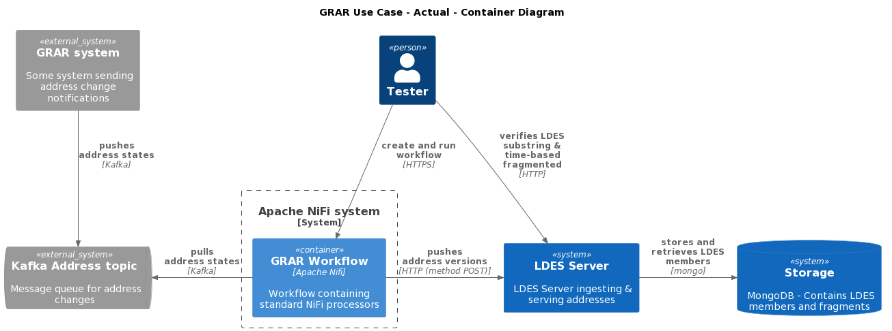
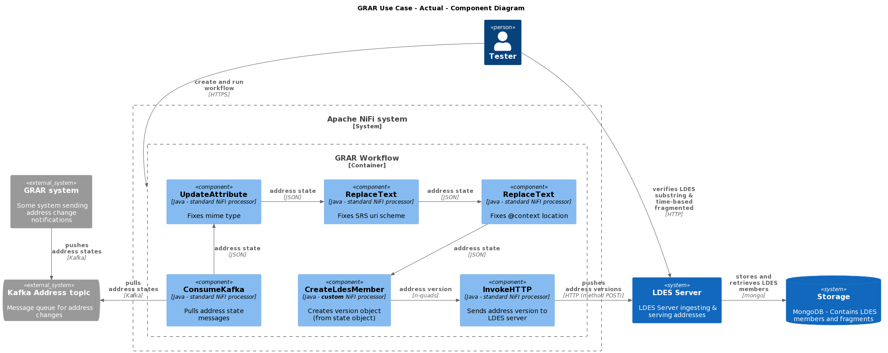
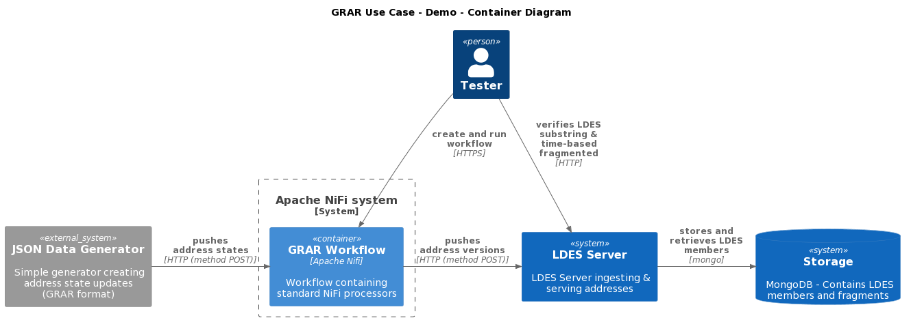

# Process GRAR Data to a Substring Fragmented LDES
The test verifies that the LDES Server can fragment an LDES using sub-sting fragmentation. It uses a context containing a [JSON Data Generator](/json-data-generator/README.md) which produces a continues stream of addresses (as a controlled alternative to the GRAR system over which we have no control), a pre-processor workflow to split messages from this generator and to fix a few GRAR data issues (set correct mime type, fix CRS uri scheme to http and change the message `@context` to a corrected context definition), a workflow containing a HTTP listener, a object version creator and a HTTP sender, and finally, the LDES Server backed by a data store (mongodb) and configured to capture the LDES members and do substring fragmentation in addition to time-based fragmentation.

The actual architecture for the GRAR use case includes a Kafka system where addresses are published on a specific topic containing messages representing new address states. This implies that some GRAR system writes these messages to the address topic and we need to read these messages (pull) into our workflow which transforms these address states into address version objects and pushes these to an LDES server configured to do substring fragmentation on some address property. 


Fig 1. Actual Context


Fig 2. Actual Containers


Fig 3. Actual Components

Because we have no control over the GRAR system, we need to use some simulator or data generator to feed our workflow. In addition, our workbench already contains a standard component that allows reading a Kafka topic. As we do not need to demonstrate the correct working of such a Kafka reader we might as well remove the complexity of including a Kafka system for demo purposes.


Fig. 4 Demo Context


Fig. 5 Demo Containers


Fig 6. Demo Components

## Test Setup
> **Note**: if needed, copy the [environment file (.env)](./.env) to a personal file (e.g. `user.env`) and change the settings as needed. If you do, you need to add ` --env-file user.env` to each `docker compose` command.

Run all systems except the workflow by executing the following (bash) command:
```bash
docker compose up -d
```
Please ensure that the LDES Server is ready to ingest by following the container log until you see the following message `Started Application in`:
```bash
docker logs --tail 1000 -f $(docker ps -q --filter "name=ldes-server$")
```
Press `CTRL-C` to stop following the log.

## Test Execution
1. Start the address updates message generation:
   ```bash
   docker compose up json-data-generator -d
   ```

2. Verify that the LDES members are ingested (execute repeatedly):
   ```bash
   curl http://localhost:9019/grar/ldesmember
   ```

3. Request the collections:
   ```bash
   curl http://localhost:8080/addresses/by-name
   curl http://localhost:8080/addresses/by-time
   ```

4. Verify that the LDES is substring fragmented: SubstringRelation
   ```bash
   curl -s 'http://localhost:8080/mobility-hindrances/by-location?substring=' | grep "substring="
   ```

## Test Teardown
To stop all systems use:
```bash
docker compose stop json-data-generator
docker compose --profile delay-started down
```
