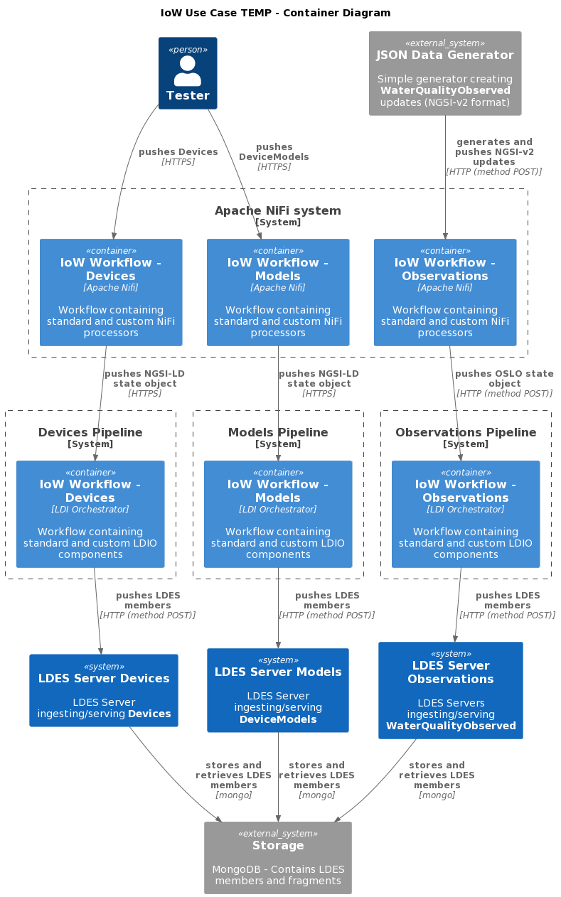
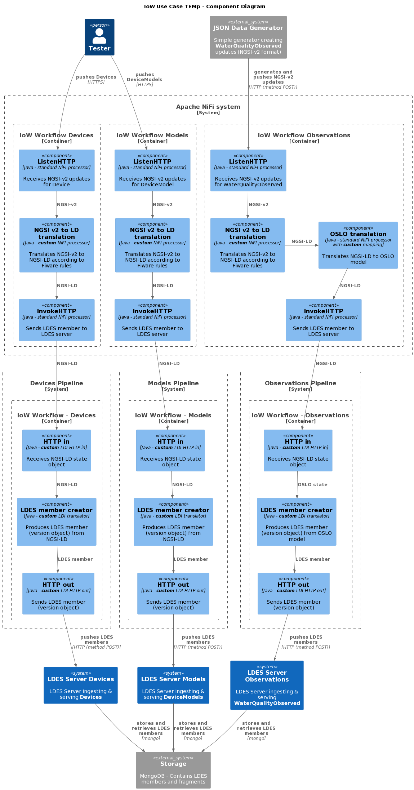

# Use New Framework Partially to Convert Water Quality NGSI-v2 to NGSI-LD or OSLO Model
This test is the first step towards a setup which does not require the use of Apache NiFi to host the workflow which converts the incoming NGSI-v2 messages towards an OSLO model (or a NGSI-LD model if no corresponding OSLO model exists). The test is based on the [previous IoW test](../015.nifi-workbench-ngsi-v2-to-oslo/README.md).

This first step towards a NiFi-less approach splits the conversion to an OSLO (or NGS-LD) model from the creation of the version object which is then ingested by an LDES server. The conversion part is still performed using a workflow hosted by an Apache NiFi. The version object creation part is executed by a [new runner](https://github.com/Informatievlaanderen/VSDS-Linked-Data-Interactions). The result is then ingested in an LDES server.

[Here](../017.ldio-workbench-ngsi-v2-to-oslo/README.md) the conversion part is fully executed within the new runner, eliminating the need for an Apache NiFi workflow. This new runner does not aim to be a full-fledged replacement for workflow engines, but rather a light-weight alternative for a simple sequence of transformation steps. In addition, it only supports RDF models as intermediate representation between processing steps.

Currently, the IoW use case is solely based on a set of similar Apache NiFi workflows which translate the NGSI-v2 messages to LDES members that can be ingested into the corresponding LDES server. Ultimately, we want to offer a solution not requiring Apache NiFi to ease deployment, prevent the NiFi learning curve and ensure a simple and cheap solution.

> **Note**: that the steps and the results are identical to these from the [previous IoW test](../015.nifi-workbench-ngsi-v2-to-oslo/README.md).

## Test Setup
> **Note**: if needed, copy the [environment file (.env)](./.env) to a personal file (e.g. `user.env`) and change the settings as needed. If you do, you need to add ` --env-file user.env` to each `docker compose` command.

1. Run all systems except the workflow by executing the following (bash) command:
    ```bash
    docker compose up -d
    ```
    Please ensure that the LDES Servers are ready to ingest by following the container logs until you see the following message `Mongock has finished`:
    ```bash
    docker logs --tail 1000 -f $(docker ps -q --filter "name=ldes-server-models$")
    docker logs --tail 1000 -f $(docker ps -q --filter "name=ldes-server-devices$")
    docker logs --tail 1000 -f $(docker ps -q --filter "name=ldes-server-observations$")
    ```
    Press `CTRL-C` to stop following each log.

2. Verify that the empty LDES views can be retrieved:
    ```bash
    curl http://localhost:8072/device-models/by-time
    curl http://localhost:8071/devices/by-time
    curl http://localhost:8073/water-quality-observations/by-time
    ```

## Test Execution
1. [Logon to Apache NiFi](../_nifi-workbench/README.md#logon-to-apache-nifi) user interface at http://localhost:8000/nifi and [create a workflow](../_nifi-workbench/README.md#create-a-workflow) from the [provided workflow](./nifi-workflow.json) and [start it](../_nifi-workbench/README.md#start-a-workflow).

    The workflow contains three flows with a standard HTTP listener (ListenHTTP), the NGSI-v2 to NGSI-LD translator, the NiFi processor creating NGSI-LD version objects and a standard InvokeHTTP processor to send the LDES members to the corresponding LDES server.

2. Verify that the NiFi HTTP listeners are ready (they should answer `OK`):
    ```bash
    curl http://localhost:9013/ngsi/device-model/healthcheck
    curl http://localhost:9012/ngsi/device/healthcheck
    curl hhttp://localhost:9014/ngsi/water-quality-observed/healthcheck
    ```

3. Send test data by using the following commands:
    ```bash
    curl -X POST http://localhost:9013/ngsi/device-model -H 'Content-Type: application/json' -d '@data/device-model.json' 
    curl -X POST http://localhost:9012/ngsi/device -H 'Content-Type: application/json' -d '@data/device.json' 
    ```
   To send a few water quality observations, briefly start the observations generator (type `CTRL-C` to stop it):
    ```bash
    docker compose up json-data-generator -d
    ```

4. Verify all LDES streams

    To validate that the LDES'es contain the correct OSLO models, you can retrieve the LDES views and follow the relations.
     ```bash
     curl http://localhost:8072/device-models/by-time
     curl http://localhost:8071/devices/by-time
     curl http://localhost:8073/water-quality-observations/by-time
     ```

     > **Note**: that only the observations are converted to an OSLO model. The object type should be `ttp://www.w3.org/ns/sosa/ObservationCollection`. The model type and the device type should still be `https://uri.etsi.org/ngsi-ld/default-context/DeviceModel` respectively `https://uri.etsi.org/ngsi-ld/default-context/Device`.

## Test Teardown
First [stop the workflow](../_nifi-workbench/README.md#stop-a-workflow) and then to stop all systems use:
```bash
docker compose stop json-data-generator
docker compose --profile delay-started down
```

## C4 Diagrams

### Context


### Container


### Component

