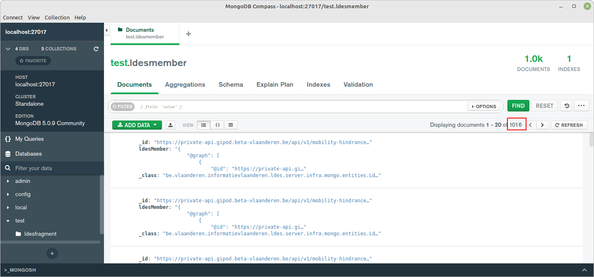

# LDES Server Can Ingest LDES Members
This test validates user story **As a data intermediary I want to request the GIPOD LDES data set without fragmentation** (VSDSPUB-61) and was shown during demo 2 on May, 24th 2022.

## Scenario: the Server Ingests N-quads
This scenario verifies that the LDES server can ingest [N-Quads](https://www.w3.org/TR/n-quads/).
```gherkin
Given an LDES member formatted as N-quads
When we send it to the LDES server ingest endpoint
Then the LDES server accepts it
```

## Scenario: the Server Returns N-quads
This scenario verifies the LDES server can return the unfragmented LDES as N-Quads.
```gherkin
Given a data set is already stored
When we request it from the LDES server consumption endpoint, formatted as N-quads
Then we receive the LDES formatted as N-quads
```

## Scenario: the Server Returns Turtle Format
This scenario verifies the LDES server can return the unfragmented LDES as other formats (such as [Turtle](https://www.w3.org/TR/turtle/), [N-triples](https://www.w3.org/TR/n-triples/), [JSON-LD](https://www.w3.org/TR/json-ld11/), etc.).
```gherkin
Given a data set is already stored
When we request it from the LDES server consumption endpoint, formatted as Turtle
Then we receive the LDES formatted as Turtle
```

## Scenario: the Server Returns the Data Set in an Unfragmented LDES
This scenario verifies the LDES server ingesting a small number of members and serves them as an unfragmented LDES.
```gherkin
Given a data set contains a (small) number of members, which fit in one response
When we request it from the LDES server consumption endpoint
Then we receive the LDES containing all members
And the result contains no fragmentation
```
> **Note**: we use 4 fragments containing 250 members each and 1 (last) fragment containing 16 members (small subset of the GIPOD).

### Test Setup
For this scenario we can use the [Simulator / Workflow / Server / Mongo](../../../support/context/simulator-workflow-server-mongo/README.md) context. If needed, copy the [environment file (.env)](./.env) to a personal file (e.g. `user.env`) and change the settings as needed. If you do, you need to add ` --env-file user.env` to each `docker compose` command.

> **Note**: you can set the `COMPOSE_FILE` environment property to the [docker compose file](../../../support/context/simulator-workflow-server-mongo/docker-compose.yml) so you do not need to provide it in each docker compose command. E.g.:
```bash
export COMPOSE_FILE="../../../support/context/simulator-workflow-server-mongo/docker-compose.yml"
```

Then you can run the systems by executing the following command:
```bash
docker compose up -d
```

### Test Execution
To run the test, you need to:
1. Seed the LDES Server Simulator with a part of the GIPOD data set
2. Upload a pre-defined NiFi workflow containing the LDES client processor and a InvokeHTTP processor (to send the LDES members to the LDES server).
3. Start the NiFi workflow and wait for it to process all LDES members.
4. Verify that all LDES members from the GIPOD simulator are received by the LDES-server.

#### 1. Upload the Data Set
Run the following (bash) command to seed the LDES Server Simulator with a part of the GIPOD data set and [alias it](./create-alias.json):
```bash
for f in ../../../data/gipod/*; do curl -X POST "http://localhost:9011/ldes" -H "Content-Type: application/ld+json" -d "@$f"; done
curl -X POST "http://localhost:9011/alias" -H "Content-Type: application/json" -d '@create-alias.json'
```

To verify that the data is correctly seeded, run this command (see [simulator](http://localhost:9011/)):
```bash
curl http://localhost:9011/
```
returns:
```json
{
    "aliases":["/api/v1/ldes/mobility-hindrances"],
    "fragments":[
        "/api/v1/ldes/mobility-hindrances?generatedAtTime=2022-04-19T12:12:49.47Z",
        "/api/v1/ldes/mobility-hindrances?generatedAtTime=2022-04-21T09:38:34.617Z",
        "/api/v1/ldes/mobility-hindrances?generatedAtTime=2022-04-28T14:50:23.317Z",
        "/api/v1/ldes/mobility-hindrances?generatedAtTime=2022-05-06T11:55:00.313Z",
        "/api/v1/ldes/mobility-hindrances?generatedAtTime=2022-05-13T11:36:49.04Z"
        ],
    "responses":{}
}
```

#### 2. Upload NiFi Workflow
Log on to the [Apache NiFi user interface](https://localhost:8443/nifi) using the user credentials provided in the `user.env` file.

Once logged in, create a new process group based on the [ingest workflow](./nifi-workflow.json) as specified in [here](../../../support/context/workflow/README.md#creating-a-workflow).

You can verify the LDES client processor properties to ensure the input source is the GIPOD simulator and the sink properties to ensure that the InvokeHTTP processor POSTs the LDES members to the LDES-server.
* the `LdesClient` component property `Datasource url` should be `http://ldes-server-simulator/api/v1/ldes/mobility-hindrances`
* the `InvokeHTTP` component property `Remote URL` should be `http://ldes-server:8080/mobility-hindrances` and the property `HTTP method` should be `POST`

#### 3. Start the Workflow
Start the workflow as described [here](../../../support/context/workflow/README.md#starting-a-workflow).

#### 4. Verify LDES Members Received
The GIPOD simulator (http://localhost:9011) is seeded by a subset of the GIPOD dataset containing five fragments of which the first four fragments contain 250 members each and the last one contains 16 members, making a total of 1016 LDES members served.

You can verify that, after some time, all (1016) LDES members are received by the LDES-server by using the [Mongo Compass](https://www.mongodb.com/products/compass) tool and verifying that the `test.ldesmember` document collection contains the LDES members (check the document count):


To get the **LDES** (event stream) itself use:
```bash
curl http://localhost:8080/mobility-hindrances
```
response:
```
@prefix ldes:                <https://w3id.org/ldes#> .
@prefix mobility-hindrances: <https://private-api.gipod.test-vlaanderen.be/api/v1/ldes/mobility-hindrances/> .
@prefix tree:                <https://w3id.org/tree#> .

<http://localhost:8080/mobility-hindrances>
        a           ldes:EventStream ;
        tree:shape  mobility-hindrances:shape ;
        tree:view   <http://localhost:8080/mobility-hindrances/by-time> .
```
You can follow the `tree:view` link to get the **view**:
```bash
curl http://localhost:8080/mobility-hindrances/by-time
```
response (similar to):
```
@prefix ldes:                <https://w3id.org/ldes#> .
@prefix mobility-hindrances: <https://private-api.gipod.test-vlaanderen.be/api/v1/ldes/mobility-hindrances/> .
@prefix tree:                <https://w3id.org/tree#> .

<http://localhost:8080/mobility-hindrances/by-time>
        a              tree:Node ;
        tree:relation  [ a          tree:Relation ;
                         tree:node  <http://localhost:8080/mobility-hindrances/by-time?generatedAtTime=2023-01-13T20:38:13.134Z>
                       ] .

<http://localhost:8080/mobility-hindrances>
        a           ldes:EventStream ;
        tree:shape  mobility-hindrances:shape ;
        tree:view   <http://localhost:8080/mobility-hindrances/by-time> .
```
Which allows you to follow the `tree:node` and retrieve the **fragment** containing the members:
```
curl <replace-by-tree:node>
```
> **Note**: you can verify that the fragment contains 1016 members by capturing the response to a file and counting the number of occurrences of `<https://data.vlaanderen.be/ns/mobiliteit#Mobiliteitshinder>`. E.g.:
```
curl --silent <replace-by-tree:node> | grep "<https://data.vlaanderen.be/ns/mobiliteit#Mobiliteitshinder>" | wc -l
```
response: 1016

In addition, you can request the members using various other formats:

Get [N-Quads](https://www.w3.org/TR/n-quads/) (fast):
```bash
curl --header 'Accept: application/n-quads' <replace-by-tree:node>
```

Get [JSON-LD](https://www.w3.org/TR/json-ld11/) (slow):
```bash
curl --header 'Accept: application/ld+json' <replace-by-tree:node>
```

### Test Teardown
First stop the workflow as described [here](../../../support/context/workflow/README.md#stopping-a-workflow) and then stop all systems as described [here](../../../support/context/simulator-workflow-sink/README.md#stop-the-systems), i.e.:
```bash
docker compose down
```
