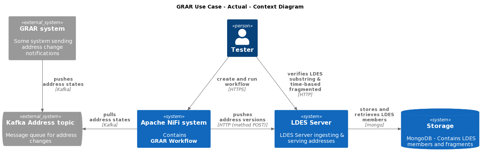
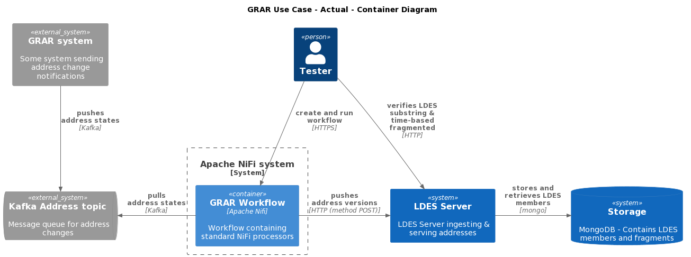
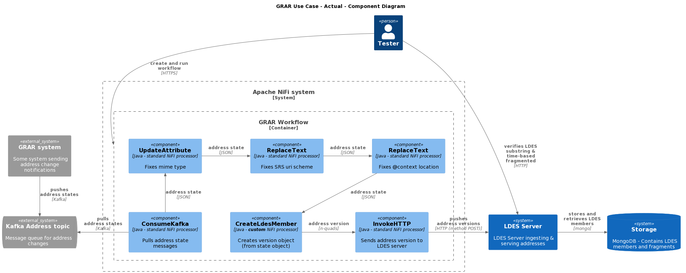

# Process GRAR Data to a Substring Fragmented LDES
This test validates user stories **As a data provider I want to offer a substring fragmentation so that consumers have autocompletion functionality when querying.** (VSDSPUB291) and, to a lesser degree, **As a data publisher I want to subscibe to the GRAR Kafka topic So I can publish it as LDES** (VSDSPUB-311).

## Test Setup Motivation
The actual architecture for the GRAR use case includes a Kafka system where addresses are published on a specific topic containing messages representing new address states. This implies that some GRAR system writes these messages to the address topic and we need to read these messages (pull) into our workflow which transforms these address states into address version objects and pushes these to an LDES server configured to do substring fragmentation on some address property. 

### Actual Context


### Actual Container


### Actual Component


Because we have no control over the GRAR system, we need to use some simulator or data generator to feed our workflow. In addition, our workbench (the Apache NiFi system) already contains a standard component that allows reading a Kafka topic. As we do not need to demonstrate the correct working of such a Kafka reader we might as well remove the complexity of including a Kafka system for demo purposes.

### Demo Context


### Demo Container


### Demo Component


## Test Setup
We use a [JSON Data Generator](/json-data-generator/README.md) which produces a continues stream of addresses (as a controlled alternative to the GRAR system over which we have no control), an Apache NiFi instance containing an HTTP listener that receives the address messages, a few standard NiFi components fixing some issues in these address messages, the custom NiFi component creating the LDES members (version objects) from the address entities, a standard NiFi component to push the version objects to the LDES server, and finally, the LDES server configured to capture the LDES members and do substring fragmentation in addition to time-based fragmentation.

If needed, copy the [environment file (.env)](./.env) to a personal file (e.g. `user.env`) and change the settings as needed. If you do, you need to add ` --env-file user.env` to each `docker compose` command. Optionally, you can change the component tags:
* JSON_DATA_GENERATOR_TAG (default: `20230130t0856`)
* LDES_WORKBENCH_NIFI_TAG (default: `20230127T135852`)
* LDES_SERVER_TAG (default: `20230131t0819`)
* MONGODB_TAG (default: `6.0.3`)

Optionally, you can change the port numbers:
* NIFI_UI_PORT (default: `8443`)
* NIFI_WORKFLOW_LISTEN_PORT_ADDRESS (default: `9012`)
* MONGODB_PORT (default: `27017`)
* LDES_SERVER_PORT (default: `8080`)

Optionally, you can change the other variables:
* SINGLE_USER_CREDENTIALS_USERNAME (Apache NiFi single user credentials - user name, default: e2etest)
* SINGLE_USER_CREDENTIALS_PASSWORD (Apache NiFi single user credentials - password, default: e2etest2022DEMO)
* USECASE_NAME (default: `grar-context`)
* JSON_DATA_GENERATOR_SILENT (default: `true`)
* JSON_DATA_GENERATOR_CRON (default: `* * * * * *`)
* JSON_DATA_GENERATOR_TEMPLATEFILE (default: `/tmp/data/address.template.json`)
* JSON_DATA_GENERATOR_MAPPINGFILE (default: `/tmp/data/address.mapping.json`)
* JSON_DATA_GENERATOR_TEMPLATE (no default, alternative for JSON_DATA_GENERATOR_TEMPLATEFILE)
* JSON_DATA_GENERATOR_MAPPING (no default, alternative for JSON_DATA_GENERATOR_MAPPINGFILE)
* LDES_SERVER_MEMBERLIMIT (default: `10`)

To create and start all systems except for the JSON Data Generator:
```bash
docker compose up -d
```

> **Note** that we do not create nor start the generator yet as we first need to create a workflow containing the HTTP listener.

To verify that all systems in the context (except for the generator) are available (please subsitute the correct ports if changed).

### LDES Client Workflow
The Apache NiFi server needs a couple of minutes to start. Use your favorite browser to connect to the Apache NiFi User Interface at [Apache NiFi user interface](https://localhost:8443/nifi) and use your credentials (provided in the `user.env` file) to login.

### Mongo Database
Browse to http://localhost:27017 or use Bash command:
```bash
curl http://localhost:27017
```
response:
```text
It looks like you are trying to access MongoDB over HTTP on the native driver port.
```
This means that the MongoDB is correctly started. To actually view the contents of the database, use a Mongo command line tool or GUI, e.g. [Compass](https://www.mongodb.com/products/compass).

### LDES Servers
Browse to http://localhost:8080/addresses (returns [RDF turtle](https://www.w3.org/TR/turtle/) format) or run an equivalent Bash command, e.g. (as [JSON-LD](https://www.w3.org/TR/json-ld11/) format):
```bash
curl -H "Accept: application/ld+json" http://localhost:8080/addresses
```
response will be similar to:
```json
{
    "@id": "http://localhost:8080/addresses",
    "tree:view": [
        {
            "@id": "addresses:by-location-and-time"
        },
        {
            "@id": "addresses:by-time"
        },
        {
            "@id": "addresses:by-name"
        }
    ],
    "ldes:timestampPath": {
        "@id": "prov:generatedAtTime"
    },
    "ldes:versionOfPath": {
        "@id": "terms:isVersionOf"
    },
    "@type": "ldes:EventStream",
    "@context": {
        "tree": "https://w3id.org/tree#",
        "addresses": "http://localhost:8080/addresses/",
        "ldes": "https://w3id.org/ldes#",
        "terms": "http://purl.org/dc/terms/",
        "prov": "http://www.w3.org/ns/prov#"
    }
}
```

## Test Execution
To run the test, you need to:
1. Upload a pre-defined NiFi workflow
2. Start the NiFi workflow
3. Start the addresses generation

### 1. Upload NiFi Workflow
Once logged in to the [workbench](https://localhost:8443/nifi), create a new process group based on the [GRAR workflow](./nifi-workflow.json) as specified in [here](../../../support/context/workflow/README.md#creating-a-workflow).

The workflow contains one flow with a standard HTTP listener (ListenHTTP), a couple of standard components to (temporary) perform various minor fixes to the message (set correct mime type, fix CRS uri scheme to http & redirect the message `@context` to a fixed context definition), the NiFi processor creating address version objects and a standard InvokeHTTP processor to send the LDES members to the LDES server.

### 2. Start the Workflow
Start the workflow as described [here](../../../support/context/workflow/README.md#starting-a-workflow).

Verify that the [HTTP listener](http://localhost:9012/grar/addresses/healthcheck) is working: it should answer `OK`.

### 3. Start the Address Updates Message Generation
To create the Docker container and start generating address messages launch the JSON Data Generator:
```bash
docker compose up json-data-generator -d
```

## Test Verification
You can now verify that the LDES continues to grow as address LDES members arrive at the [LDES server](http://localhost:8080/addresses). It creates an ever growing, substring fragmented LDES view in addition to the time-based one.
```bash
curl http://localhost:8080/addresses/by-name
curl http://localhost:8080/addresses/by-time
```

## Stop the Systems
To stop all systems in the context:
```bash
docker compose stop json-data-generator
docker compose --profile delay-started down
```
This will gracefully shutdown all systems in the context and remove them.
