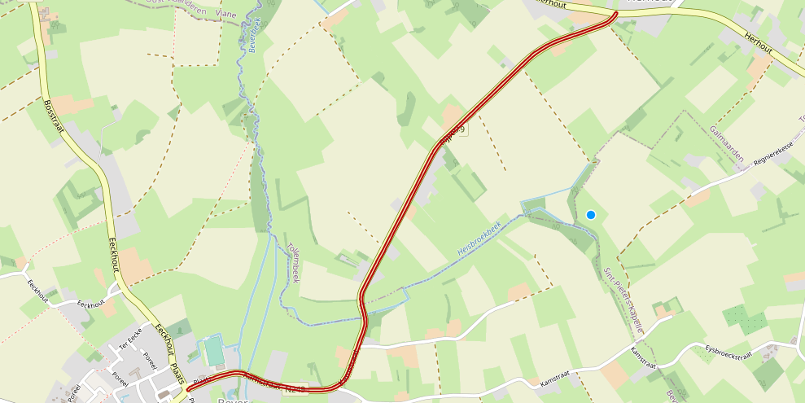

# LDES Server Can Fragment an LDES Using Geospatial Fragmentation
This test validates user story **As a Data Intermediary (business role) I want to fragment the GTFS/RT dataset using a geo-spatial fragmentation so I can query an LDES on geographic area in a more efficient way** (VSDSPUB-207) and was shown during demo 1 on August, 16th 2022.

## LDES Server
The LDES Server provides some configuration to cover the following acceptance criteria:
* can configure LDES server to use geo-spatial fragmentation (instead of the default time-based fragmentation)
* can configure geo-spatial bucketizer with a geospatial property ([WKT format](https://opengeospatial.github.io/ogc-geosparql/geosparql11/spec.html#_rdfs_datatype_geowktliteral))
* can configure geo-spatial bucketizer with a zoom level
* can configure geo-spatial fragmentizer with a max member count per (member) fragment

Currently, the following criteria is not yet implemented:
* can configure geo-spatial fragmentizer with a max relation count per (tile) fragment

## Bucketizer
The geospatial bucketizer covers the following acceptance criteria:
* geo-spatial bucketizer adds LDES members to one or more geo-spatial tiles based on the configured geographic property (geo-spatial bucketizer adds buckets based on the geographic property)
* geo-spatial bucketizer does not add buckets to the LDES member content (buckets are transient and passed to the geo-spatial fragmentizer)
* geo-spatial bucketizer uses (for now) a fixed algorithm for calculate the buckets ([slippy maps](https://wiki.openstreetmap.org/wiki/Slippy_map_tilenames))

As the geospatial bucketizer is an internal component we can only demonstrate its behavior by demonstrating the geospatial fragmentizer.

## Fragmentizer
The geospatial fragmentizer currently does not cover the following acceptance criteria but introduces an alternative implementation:
* geo-spatial fragmentizer assigns an LDES member to exactly one member fragment (but an LDES member can span multiple tiles and therefore appear in multiple member fragments - belonging to different tiles!)
* geo-spatial fragmentizer creates a tile fragment containing all available fragments per tile
* geo-spatial fragmentizer creates a root fragment containing all available tile fragments
* geo-spatial fragmentizer re-structures the search tree when the max relation count is reached for a tile fragment
* geo-spatial fragmentizer assigns bucket-less (e.g. missing geographic property value) members to a member fragment of an “empty” tile fragment (so no members are dropped)
* geo-spatial bucketizer and fragmentizer use the initial configuration (and do not take configuration changes into account)
* geo-spatial fragmentizer creates intermediate tile fragments on a as-needed basis and not a-priori

The current implementation takes a simplified view on how the fragments are related: every fragment contains one or more relations of type `tree:GeospatiallyContainsRelation` with its `tree:path` containing the tile's bounding box expressed as WKT. This allows a fragment to point to its neighboring fragments. In addition, every fragment already contains members.

### Test Setup
To demonstrate the geospatial fragmentation, we use a adapted version of the [Simulator / Workflow / Server / Mongo](../../../support/context/simulator-workflow-server-mongo/README.md) context. Please copy the [environment file (geospatial-fragment.env)](./geospatial-fragment.env) to a personal file (e.g. `user.env`) and fill in the mandatory arguments.

The environment file is already configured for geospatial fragmentation but you can tune the configuration settings as described [here](../../../support/context/simulator-workflow-server-mongo/README.md#geospatial-fragmentation). Please note the specific configuration properties which allow to configure which fragmentizer to use as well as the specific geospatial bucketizer and fragmentizer properties:
* GEOSPATIAL_MAXZOOMLEVEL=15 (tune as needed)

> **Note**: make sure to verify the settings in your personal `user.env` file to contain the correct file paths, relative to your system or the container where appropriate, etc.

You can then run the systems by executing the following command:
```bash
docker compose --env-file user.env up
```

Log on to the [Apache NiFi user interface](https://localhost:8443/nifi) using the user credentials provided in the `user.env` file.

Once logged in, create a new process group based on the [ingest workflow](./nifi-workflow.json) as specified in [here](../../../support/context/workflow/README.md#creating-a-workflow).

You can verify the LDES client processor properties to ensure the input source is the GIPOD simulator and the sink properties to ensure that the InvokeHTTP processor POSTs the LDES members to the LDES-server.
* the `LdesClient` component property `Datasource url` should be `http://ldes-server-simulator/api/v1/ldes/mobility-hindrances` -- **note** that we use an alias here to ease the use of different data sets
* the `InvokeHTTP` component property `Remote URL` should be `http://ldes-server:8080/mobility-hindrances` and the property `HTTP method` should be `POST`

The test data set contains only one version object spanning multiple tiles and therefore consists of a [single file containing one member](./data/one-member.jsonld). This data set is used:
* to demonstrate the geospatial bucketizer's ability to correctly create (multiple) buckets for a given member based on the configured property,
* to verify that the generated buckets values (`ldes:bucket`) are not present in the generated fragments and
* to illustrate the current strategy used by the geospatial fragmentation to create fragments and the relations included.

### Test Execution
To verify the above acceptance criteria:
* visualize the GIPOD hindrance
* ingest the data set
* verify the fragments
    * contains the member without buckets
    * follow all geospatial links
    * visualize the combined tiles

#### 1. Visualize the GIPOD Hindrance
The GIPOD data set uses [Belgian Lambert 72](https://epsg.io/31370) as the [CRS](https://www.w3.org/2015/spatial/wiki/Coordinate_Reference_Systems) while the standard is [WGS 84](https://epsg.io/4326). In order to display a GIPOD hindrance with an [online tool](https://clydedacruz.github.io/openstreetmap-wkt-playground/) we first need to convert the geospatial value to the standard CRS. These values are polygons (with many points) while online tools only support the conversion of a single point. To ease this conversion bfrom [Belgian Lambert 72](https://epsg.io/31370) to [WGS 84](https://epsg.io/4326) we provided a [custom conversion tool](../../../../wkt-conversion-tool/README.md).

Convert the GIPOD hindrance zone (zone.geometry.wkt) using our custom tool (it overwrites the [existing file](./wkt/out.wkt)), e.g.:
```bash
alias bd72-wgs84="node ../../../../wkt-conversion-tool/main.js --file"
bd72-wgs84 ./wkt/in.wkt > ./wkt/out.wkt
```

Now you can plot the [shape](./wkt/out.wkt) using the [online tool](https://clydedacruz.github.io/openstreetmap-wkt-playground/). This results in:



#### 2. Ingest the Data Set
You need to ingest the data set ([single file containing one member](./data/one-member.jsonld)) and [alias it](./create-alias.json):
```bash
curl -X POST http://localhost:9011/ldes -H 'Content-Type: application/json-ld' -d '@data/one-member.jsonld'
curl -X POST http://localhost:9011/alias -H "Content-Type: application/json" -d '@create-alias.json'
```

After that you can start the workflow as described [here](../../../support/context/workflow/README.md#starting-a-workflow) and wait for the fragments to be created (call repeatedly until it returns some relations):
```bash
curl http://localhost:8080/mobility-hindrances-by-location?tile=0/0/0
```

Alternatively you can use the [Mongo Compass](https://www.mongodb.com/products/compass) tool and verifying that the `ldesmember` document collection contains one LDES member and the `ldesfragments` document collection contains four LDES fragments (apart from the geo-spatial root fragment 0/0/0 and the real root/redirection fragment).

#### 3. Verify the Fragments
We have configured the zoom level (= 15) in such a way that the geospatial fragmentation creates four tile fragments (15 / x / y) and when combined in the appropriate way they correspond to the image we had when visualizing the member:

|Tile|16742|16743|16744|
|-|-|-|-|
|**11009**||||
|**11010**||||

### Test Teardown
First stop the workflow as described [here](../../../support/context/workflow/README.md#stopping-a-workflow) and then stop all systems, i.e.:
```bash
docker compose --env-file user.env down
```
