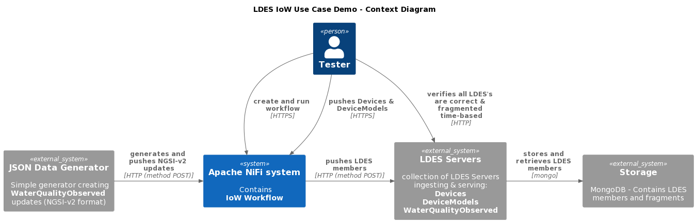
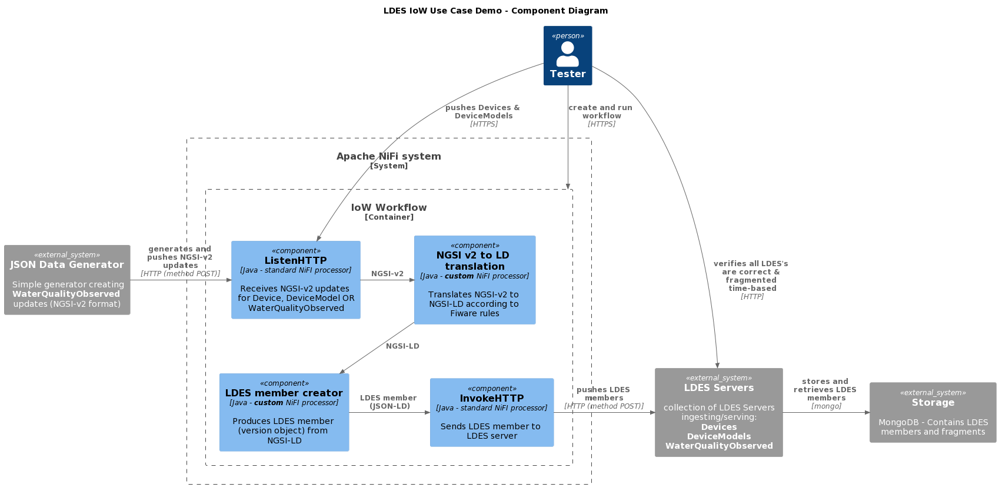

# Ingest NGSI-v2 objects into LDES server
This test validates user story **Publish IoW data using time-based fragmentation** (VSDSPUB-260).

## Test Setup
We use a [JSON Data Generator](/json-data-generator/README.md) which produces a continues stream of water-quality observations (as a controlled alternative to an actual Orion broker over which we have no control), an Apache NiFi instance containing an HTTP listener that receives the observations (and devices & models), the NiFi components translating the NGSI-v2 entities to NGSI-LD entities, the NiFi components creating the LDES members (version objects) from the NGSI-LD entities and the LDES servers configured to capture the LDES members.

If needed, copy the [environment file (.env)](./.env) to a personal file (e.g. `user.env`) and change the settings as needed. If you do, you need to add ` --env-file user.env` to each `docker compose` command.

Optionally, you can change the component tags:
* JSON_DATA_GENERATOR_TAG (default: `20230214t1503`)
* LDES_WORKBENCH_NIFI_TAG (default: `20230214t123440`)
* LDES_SERVER_TAG (default: `20230214t1234`)
* MONGODB_TAG (default: `6.0.4`)

Optionally, you can change the port numbers:
* NIFI_UI_PORT (default: `8443`)
* NIFI_WORKFLOW_LISTEN_PORT_DEVICE (default: `9012`)
* NIFI_WORKFLOW_LISTEN_PORT_DEVICEMODEL (default: `9013`)
* NIFI_WORKFLOW_LISTEN_PORT_WATERQUALITYOBSERVED (default: `9014`)
* MONGODB_PORT (default: `27017`)
* DEVICES_LDES_SERVER_PORT (default: `8071`)
* MODELS_LDES_SERVER_PORT (default: `8072`)
* OBSERVATIONS_LDES_SERVER_PORT (default: `8073`)

Optionally, you can change the other variables:
* SINGLE_USER_CREDENTIALS_USERNAME (Apache NiFi single user credentials - user name, default: `e2etest`)
* SINGLE_USER_CREDENTIALS_PASSWORD (Apache NiFi single user credentials - password, default: `e2etest2022DEMO`)
* USECASE_NAME (default: `iow-context`)
* JSON_DATA_GENERATOR_SILENT (default: `true`)
* JSON_DATA_GENERATOR_CRON (default: `* * * * * *`)
* JSON_DATA_GENERATOR_TEMPLATEFILE (default: `/tmp/data/wqo.template.json`)
* JSON_DATA_GENERATOR_MAPPINGFILE (default: `/tmp/data/wqo.mapping.json`)
* JSON_DATA_GENERATOR_TEMPLATE (no default, alternative for JSON_DATA_GENERATOR_TEMPLATEFILE)
* JSON_DATA_GENERATOR_MAPPING (no default, alternative for JSON_DATA_GENERATOR_MAPPINGFILE)
* DEVICES_LDES_SERVER_MEMBERLIMIT (default: `10`)
* MODELS_LDES_SERVER_MEMBERLIMIT (default: `10`)
* OBSERVATIONS_LDES_SERVER_MEMBERLIMIT (default: `100`)

To create and start all systems except for the JSON Data Generator:
```bash
docker compose up -d
```
> **Note**: it may take a minute for all the servers to start.

> **Note** that we do not create nor start the generator yet as we first need to create a workflow containing the HTTP listeners.

To verify that all systems in the context (except for the generator) are available (please subsitute the correct ports if changed):

### LDES Client Workflow
The Apache NiFi server needs a couple of minutes to start. Use your favorite browser to connect to the Apache NiFi User Interface at [Apache NiFi user interface](https://localhost:8443/nifi) and use your credentials (provided in the `user.env` file) to login.

### Mongo Database
Browse to http://localhost:27017 or use Bash command:
```bash
curl http://localhost:27017
```
response:
```text
It looks like you are trying to access MongoDB over HTTP on the native driver port.
```
This means that the MongoDB is correctly started. To actually view the contents of the database, use a Mongo command line tool or GUI, e.g. [Compass](https://www.mongodb.com/products/compass).

### LDES Servers
Browse to http://localhost:8073/water-quality-observations (returns [RDF turtle](https://www.w3.org/TR/turtle/) format) or run an equivalent Bash command, e.g. (as [JSON-LD](https://www.w3.org/TR/json-ld11/) format):
```bash
curl -H "Accept: application/ld+json" http://localhost:8073/water-quality-observations
```
response will be similar to:
```json
{
    "@graph": [
        {
            "@id": "http://localhost:8073/water-quality-observations",
            "tree:view": {
                "@id": "water-quality-observations:by-time"
            },
            "ldes:timestampPath": {
                "@id": "prov:generatedAtTime"
            },
            "ldes:versionOfPath": {
                "@id": "terms:isVersionOf"
            },
            "@type": "ldes:EventStream"
        },
        {
            "@id": "water-quality-observations:by-time",
            "@type": "tree:Node"
        }
    ],
    "@context": {
        "tree": "https://w3id.org/tree#",
        "ldes": "https://w3id.org/ldes#",
        "terms": "http://purl.org/dc/terms/",
        "prov": "http://www.w3.org/ns/prov#",
        "water-quality-observations": "http://localhost:8073/water-quality-observations/"
    }
}
```
You can also check the models and devices LDES servers:
```bash
curl http://localhost:8071/devices
curl http://localhost:8072/device-models
```

## Test Execution
To run the test, you need to:
1. Upload a pre-defined NiFi workflow
2. Start the NiFi workflow
3. Upload devices and models
4. Start the observations generation

### 1. Upload NiFi Workflow
Once logged in, create a new process group based on the [iow workflow](./nifi-workflow.json) as specified in [here](../../../support/context/workflow/README.md#creating-a-workflow).

The workflow contains three flows with a standard HTTP listener (ListenHTTP), the NGSI-v2 to NGSI-LD translator, the NiFi processor creating NGSI-LD version objects and a standard InvokeHTTP processor to send the LDES members to the corresponding LDES server.

### 2. Start the Workflow
Start the workflow as described [here](../../../support/context/workflow/README.md#starting-a-workflow).

Verify that the HTTP listeners are working: they should answer `OK`.
* http://localhost:9012/ngsi/device/healthcheck
* http://localhost:9013/ngsi/device-model/healthcheck
* http://localhost:9014/ngsi/water-quality-observed/healthcheck

### 3. Upload Devices and Models
Upload the given (or your own) [device](./data/device.json) and [device model](./data/device-model.json) test files to the correct ListenHTTP processor:
```bash
curl -X POST http://localhost:9012/ngsi/device -H 'Content-Type: application/json' -d '@data/device.json' 
curl -X POST http://localhost:9013/ngsi/device-model -H 'Content-Type: application/json' -d '@data/device-model.json' 
```

### 4. Start the Observations Generation
To create the Docker container and start generating `WaterQualityObserved` messages launch the JSON Data Generator:
```bash
docker compose up json-data-generator -d
```

## Test Verification
You can now verify that all three LDES streams are available (see the [devices LDES server](http://localhost:8071/devices/by-time) and the [models LDES server](http://localhost:8072/models/by-time)) and that the observations LDES continues to grow as `WaterQualityObserved` LDES members arrive at the [observations LDES server](http://localhost:8073/observations/by-time). They will form an ever growing, time-based fragmented LDES stream.
```bash
curl http://localhost:8071/devices/by-time
curl http://localhost:8072/device-models/by-time
curl http://localhost:8073/water-quality-observations/by-time
```

## Stop the Systems
To stop all systems in the context:
```bash
docker compose stop json-data-generator
docker compose --profile delay-started down
```
This will gracefully shutdown all systems in the context and remove them.

## C4 Diagrams

### Context


### Container


### Component

