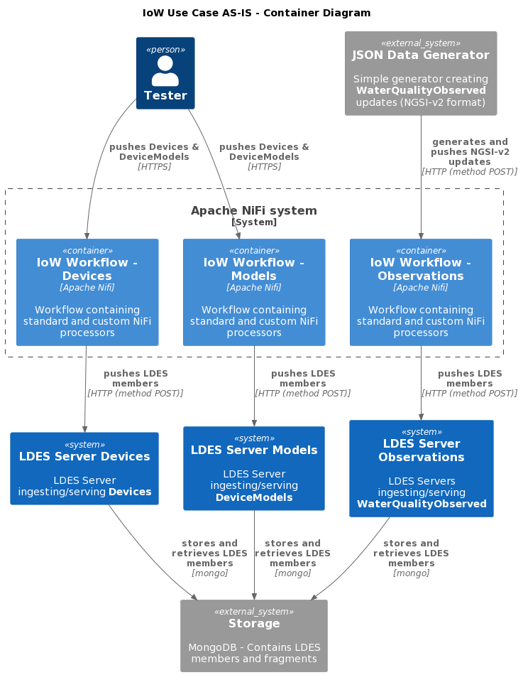

# Use New Framework to Convert Water Quality NGSI-v2 to NGSI-LD or OSLO Model
This test demonstrates **As a datapublisher, I want to have generic buildingblocks, so that they fit better in my technical architecture** (VSDSPUB-471).

This is the first step towards a setup which does not require the use of Apache NiFi to host the workflow which converts the incoming NGSI-v2 messages towards an OSLO model (or a NGSI-LD model if no corresponding OSLO model exists). The test is based on the [previous IoW test](../4.oslo-model-using-jolt/README.md).

This first step towards a NiFi-less approach splits the conversion to an OSLO (or NGS-LD) model from the creation of the version object which is then ingested by an LDES server. The conversion part is still performed using a workflow hosted by an Apache NiFi. The version object creation part is executed by a [new runner](https://github.com/Informatievlaanderen/VSDS-Linked-Data-Interactions). The result is then ingested in an LDES server.

At a later time the conversion part will also be executed within the new runner, eliminating the need for an Apache NiFi workflow. This new runner does not aim to be a full-fledged replacement for workflow engines, but rather a light-weight alternative for a simple sequence of transformation steps. In addition, it only supports RDF models as intermediate representation between processing steps.

Currently, the IoW use case is solely based on a set of similar Apache NiFi workflows which translate the NGSI-v2 messages to LDES members that can be ingested into the corresponding LDES server. Ultimately, we want to offer a solution not requiring Apache NiFi to ease deployment, prevent the NiFi learning curve and ensure a simple and cheap solution.

### Context
For this test we have this context:

AS-IS|TEMP|TO-BE|
|:-:|:-:|:-:|
||||

### Container
If we break down the context into their containers, we get:

|AS-IS|TEMP|TO-BE|
|:-:|:-:|:-:|
||||

### Component
Breaking the containers further down into components, we get:

|AS-IS|TEMP|TO-BE|
|:-:|:-:|:-:|
||||

## Test Setup
To setup this test, you can optionally configure a custom environment file and then launch all systems and verify the initial state.

### Configure Environment File
If needed, copy the [environment file (.env)](./.env) to a personal file (e.g. `user.env`) and change the settings as needed. If you do, you need to add ` --env-file user.env` to each `docker compose` command. E.g. you can change the component tags:

* JSON_DATA_GENERATOR_TAG (default: `20230214t1503`)
* LDES_WORKBENCH_NIFI_TAG (default: `20230214t123440`)
* LDES_SERVER_TAG (default: `20230214t1234`)
* MONGODB_TAG (default: `6.0.4`)
* LDI_ORCHESTRATOR_TAG (default: `20230224t1457`)

### Launch Systems
You can start all the required systems except for the observations generator using (a bash) command:
```bash
docker compose up -d
```
> **Note**: it may take a minute for all the servers to start.

### Verify Initial State
Once the LDES servers are launched, you can verify that the initial LDES'es are empty.

To check the device models view:
```bash
curl http://localhost:8072/device-models/by-time
```
returns:
```
@prefix device-models: <http://localhost:8072/device-models/> .
@prefix ldes:          <https://w3id.org/ldes#> .
@prefix prov:          <http://www.w3.org/ns/prov#> .
@prefix terms:         <http://purl.org/dc/terms/> .
@prefix tree:          <https://w3id.org/tree#> .

<http://localhost:8072/device-models>
        a                   ldes:EventStream ;
        ldes:timestampPath  prov:generatedAtTime ;
        ldes:versionOfPath  terms:isVersionOf ;
        tree:view           device-models:by-time .

device-models:by-time
        a       tree:Node .
```
To check the devices view:
```bash
curl http://localhost:8071/devices/by-time
```
returns:
```
@prefix devices: <http://localhost:8071/devices/> .
@prefix ldes:    <https://w3id.org/ldes#> .
@prefix prov:    <http://www.w3.org/ns/prov#> .
@prefix terms:   <http://purl.org/dc/terms/> .
@prefix tree:    <https://w3id.org/tree#> .

devices:by-time  a  tree:Node .

<http://localhost:8071/devices>
        a                   ldes:EventStream ;
        ldes:timestampPath  prov:generatedAtTime ;
        ldes:versionOfPath  terms:isVersionOf ;
        tree:view           devices:by-time .
```
To check the water quality observations view:
```bash
curl http://localhost:8073/water-quality-observations/by-time
```
returns:
```
@prefix ldes:                       <https://w3id.org/ldes#> .
@prefix prov:                       <http://www.w3.org/ns/prov#> .
@prefix terms:                      <http://purl.org/dc/terms/> .
@prefix tree:                       <https://w3id.org/tree#> .
@prefix water-quality-observations: <http://localhost:8073/water-quality-observations/> .

<http://localhost:8073/water-quality-observations>
        a                   ldes:EventStream ;
        ldes:timestampPath  prov:generatedAtTime ;
        ldes:versionOfPath  terms:isVersionOf ;
        tree:view           water-quality-observations:by-time .

water-quality-observations:by-time
        a       tree:Node .
```

## Test Execution
In order to execute the test, you need to load & configure a workflow and send some test data.

### Load & Configure Workflow
Please logon to the Apache Nifi system at https://localhost:8443/nifi and add the [workflow](./nifi-workflow.json) (see [here](../../../support/context/workflow/README.md#creating-a-workflow) for details).

Start the workflow and verify that the workflow's HTTP listeners are ready to accept entities.
* http://localhost:9012/ngsi/device/healthcheck
* http://localhost:9013/ngsi/device-model/healthcheck
* http://localhost:9014/ngsi/water-quality-observed/healthcheck

### Send Test Data
To send a test model and a test device execute the following commands:
```bash
curl -X POST http://localhost:9013/ngsi/device-model -H 'Content-Type: application/json' -d '@data/device-model.json' 
curl -X POST http://localhost:9012/ngsi/device -H 'Content-Type: application/json' -d '@data/device.json' 
```

To send a few water quality observations, briefly start the observations generator (type `CTRL-C` to stop it):
```bash
docker compose up json-data-generator -d
```

## Test Validation
Validate the device models LDES by following the `tree:node` value found in http://localhost:8072/device-models/by-time, e.g.
```bash
curl http://localhost:8072/device-models/by-time?generatedAtTime=2023-02-27T14:43:37.291Z
```
this results in something similar to:
```
@prefix default-context: <https://uri.etsi.org/ngsi-ld/default-context/> .
@prefix ldes:            <https://w3id.org/ldes#> .
@prefix ngsi-ld:         <https://uri.etsi.org/ngsi-ld/> .
@prefix prov:            <http://www.w3.org/ns/prov#> .
@prefix terms:           <http://purl.org/dc/terms/> .
@prefix tree:            <https://w3id.org/tree#> .

<http://localhost:8072/device-models/by-time?generatedAtTime=2023-02-27T14:43:37.291Z>
        a               tree:Node ;
        terms:isPartOf  <http://localhost:8072/device-models> .

<urn:ngsi-v2:cot-imec-be:devicemodel:imec-iow-sensor-v0005/2023-02-27T14:46:27.096Z>
        a                               default-context:DeviceModel ;
        terms:isVersionOf               <urn:ngsi-v2:cot-imec-be:devicemodel:imec-iow-sensor-v0005> ;
        prov:generatedAtTime            "2023-02-27T14:46:27.096Z"^^<http://www.w3.org/2001/XMLSchema#dateTime> ;
        default-context:brandName       [ a                 ngsi-ld:Property ;
                                          ngsi-ld:hasValue  "imec"
                                        ] ;
        default-context:category        [ a                 ngsi-ld:Property ;
                                          ngsi-ld:hasValue  "sensor"
                                        ] ;
        default-context:controlledProperty
                [ a                 ngsi-ld:Property ;
                  ngsi-ld:hasValue  "nitrate" , "pH" , "conductivity" , "temperature"
                ] ;
        default-context:function        [ a                 ngsi-ld:Property ;
                                          ngsi-ld:hasValue  "sensing"
                                        ] ;
        default-context:iow_tags        [ a                 ngsi-ld:Property ;
                                          ngsi-ld:hasValue  "wqmd_sensor"
                                        ] ;
        default-context:manufacturerName
                [ a                 ngsi-ld:Property ;
                  ngsi-ld:hasValue  "IMEC NL"
                ] ;
        default-context:maxTimeBetweenObservations
                [ a                 ngsi-ld:Property ;
                  ngsi-ld:hasValue  60
                ] ;
        default-context:modelName       [ a                 ngsi-ld:Property ;
                                          ngsi-ld:hasValue  "iow-sensor-v0005"
                                        ] ;
        default-context:supportedUnits  [ a                 ngsi-ld:Property ;
                                          ngsi-ld:hasValue  "Q30" , "D10" , "CEL"
                                        ] .

<http://localhost:8072/device-models>
        a            ldes:EventStream ;
        tree:member  <urn:ngsi-v2:cot-imec-be:devicemodel:imec-iow-sensor-v0005/2023-02-27T14:46:27.096Z> .
```

Validate the devices LDES by following the `tree:node` value found in http://localhost:8071/devices/by-time, e.g.
```bash
curl http://localhost:8071/devices/by-time?generatedAtTime=2023-02-27T14:43:39.146Z
```
this results in something similar to:
```
@prefix default-context: <https://uri.etsi.org/ngsi-ld/default-context/> .
@prefix ldes:            <https://w3id.org/ldes#> .
@prefix ngsi-ld:         <https://uri.etsi.org/ngsi-ld/> .
@prefix prov:            <http://www.w3.org/ns/prov#> .
@prefix terms:           <http://purl.org/dc/terms/> .
@prefix tree:            <https://w3id.org/tree#> .
@prefix vocab:           <https://purl.org/geojson/vocab#> .

<http://localhost:8071/devices/by-time?generatedAtTime=2023-02-27T14:43:39.146Z>
        a               tree:Node ;
        terms:isPartOf  <http://localhost:8071/devices> .

<http://localhost:8071/devices>
        a            ldes:EventStream ;
        tree:member  <urn:ngsi-v2:cot-imec-be:Device:imec-iow-UR5gEycRuaafxnhvjd9jnU/2023-02-27T14:45:55.646Z> .

<urn:ngsi-v2:cot-imec-be:Device:imec-iow-UR5gEycRuaafxnhvjd9jnU/2023-02-27T14:45:55.646Z>
        a                               default-context:Device ;
        terms:isVersionOf               <urn:ngsi-v2:cot-imec-be:Device:imec-iow-UR5gEycRuaafxnhvjd9jnU> ;
        prov:generatedAtTime            "2023-02-27T14:45:55.646Z"^^<http://www.w3.org/2001/XMLSchema#dateTime> ;
        default-context:adminState      [ a                 ngsi-ld:Property ;
                                          ngsi-ld:hasValue  "down"
                                        ] ;
        default-context:alternativeIds  [ a                 ngsi-ld:Property ;
                                          ngsi-ld:hasValue  "octa_dec.2336861766884020237" , "simcard.206012902136977"
                                        ] ;
        default-context:batteryLevel    [ a                         ngsi-ld:Property ;
                                          default-context:rawValue  [ a                 ngsi-ld:Property ;
                                                                      ngsi-ld:hasValue  "3192"
                                                                    ] ;
                                          default-context:rawValueUnitCode
                                                  [ a                 ngsi-ld:Property ;
                                                    ngsi-23-02-27T15:59:18.006ld:hasValue  "2Z"
                                                  ] ;
                                          ngsi-ld:hasValue          3.2E-1
                                        ] ;
        default-context:calibrationParameters
                [ a                 ngsi-ld:Property ;
                  ngsi-ld:hasValue  [ default-context:battery  [ default-context:gain    600 ;
                                                                 default-context:offset  3000
                                                               ]
                                    ]
                ] ;
        default-context:copyObservationAttributes
                [ a                 ngsi-ld:Property ;
                  ngsi-ld:hasValue  "batteryLevel"
                ] ;
        default-context:dateLastValueReported
                [ a                 ngsi-ld:Property ;
                  ngsi-ld:hasValue  "2022-06-28T08:26:06.000Z"^^ngsi-ld:DateTime
                ] ;
        default-context:extraMeasurementAttributes
                [ a                 ngsi-ld:Property ;
                  ngsi-ld:hasValue  [ default-context:locationName   true ;
                                      default-context:samplingPoint  true ;
                                      ngsi-ld:location               true
                                    ]
                ] ;
        default-context:healthState     [ a                 ngsi-ld:Property ;
                                          ngsi-ld:hasValue  "up"
                                        ] ;
        default-context:locationName    [ a                 ngsi-ld:Property ;
                                          ngsi-ld:hasValue  "loc-00056-19"
                                        ] ;
        default-context:maxTimeBetweenObservations
                [ a                 ngsi-ld:Property ;
                  ngsi-ld:hasValue  60
                ] ;
        default-context:name            [ a                 ngsi-ld:Property ;
                                          ngsi-ld:hasValue  "box-00145-49"
                                        ] ;
        default-context:owner           [ a                 ngsi-ld:Property ;
                                          ngsi-ld:hasValue  "imec"
                                        ] ;
        default-context:refDeviceModel  [ a                  ngsi-ld:Relationship ;
                                          ngsi-ld:hasObject  <urn:ngsi-v2:cot-imec-be:devicemodel:imec-iow-sensor-v0005>
                                        ] ;
        default-context:samplingPoint   [ a                 ngsi-ld:Property ;
                                          ngsi-ld:hasValue  "spt-00000-87"
                                        ] ;
        default-context:source          [ a                 ngsi-ld:Property ;
                                          ngsi-ld:hasValue  "cot.iow.observed"
                                        ] ;
        ngsi-ld:location                [ a                     ngsi-ld:GeoProperty ;
                                          default-context:name  [ a                 ngsi-ld:Property ;
                                                                  ngsi-ld:hasValue  "loc-00056-19"
                                                                ] ;
                                          ngsi-ld:hasValue      [ a                  vocab:Point ;
                                                                  vocab:coordinates  ( 5.4563E0 5.141363E1 )
                                                                ]
                                        ] .
```

Validate the observations LDES by following the `tree:node` value found in http://localhost:8073/water-quality-observations/by-time, e.g.
```bash
curl http://localhost:8073/water-quality-observations/by-time?generatedAtTime=2023-02-27T14:47:46.226Z
```
this results in something similar to:
```
@prefix Measurement:             <http://def.isotc211.org/iso19156/2011/Measurement#> .
@prefix id:                      <https://data.vmm.be/id/> .
@prefix ldes:                    <https://w3id.org/ldes#> .
@prefix observatieparameter:     <https://data.vmm.be/concept/observatieparameter/> .
@prefix prov:                    <http://www.w3.org/ns/prov#> .
@prefix sosa:                    <http://www.w3.org/ns/sosa/> .
@prefix terms:                   <http://purl.org/dc/terms/> .
@prefix tree:                    <https://w3id.org/tree#> .
@prefix waterkwaliteitparameter: <https://data.vmm.be/concept/waterkwaliteitparameter/> .

<urn:ngsi-ld:WaterQualityObserved:woq:6/2023-02-27T14:53:19.001Z>
        a                          <https://www.w3.org/TR/vocab-ssn-ext/#sosa:ObservationCollection> ;
        <http://def.isotc211.org/iso19156/2011/SamplingFeature#SF_SamplingFeatureCollection.member>
                id:loc-00019-33 ;
        <http://def.isotc211.org/iso19156/2011/SamplingFeature#SF_SamplingFeatureCollection.member>
                [ a                  Measurement:OM_Measurement ;
                  <http://def.isotc211.org/iso19156/2011/Observation#OM_Observation.featureOfInterest>
                          id:spt-00035-79 ;
                  <http://def.isotc211.org/iso19156/2011/Observation#OM_Observation.observedProperty>
                          waterkwaliteitparameter:temperatuur ;
                  <http://def.isotc211.org/iso19156/2011/Observation#OM_Observation.phenomenonTime>
                          "2023-02-27T14:53:19.001Z"^^<http://www.w3.org/2001/XMLSchema#datetime> ;
                  <http://def.isotc211.org/iso19156/2011/Observation#OM_Observation.result>
                          [ <http://def.isotc211.org/iso19103/2005/UnitsOfMeasure#Measure.value>
                                    [ <https://schema.org/unitCode>  id:CEL ;
                                      <https://schema.org/value>     2.043E1
                                    ]
                          ] ;
                  sosa:madeBySensor  <urn:ngsi-v2:cot-imec-be:Device:imec-iow-UR5gEycRuaafxnhvjd9jnU>
                ] ;
        <http://def.isotc211.org/iso19156/2011/SamplingFeature#SF_SamplingFeatureCollection.member>
                [ a                  Measurement:OM_Measurement ;
                  <http://def.isotc211.org/iso19156/2011/Observation#OM_Observation.featureOfInterest>
                          id:spt-00035-79 ;
                  <http://def.isotc211.org/iso19156/2011/Observation#OM_Observation.observedProperty>
                          observatieparameter:hydrostatische-druk ;
                  <http://def.isotc211.org/iso19156/2011/Observation#OM_Observation.phenomenonTime>
                          "2023-02-27T14:53:19.001Z"^^<http://www.w3.org/2001/XMLSchema#datetime> ;
                  <http://def.isotc211.org/iso19156/2011/Observation#OM_Observation.result>
                          [ <http://def.isotc211.org/iso19103/2005/UnitsOfMeasure#Measure.value>
                                    [ <https://schema.org/unitCode>  id:HP ;
                                      <https://schema.org/value>     1442
                                    ]
                          ] ;
                  sosa:madeBySensor  <urn:ngsi-v2:cot-imec-be:Device:imec-iow-UR5gEycRuaafxnhvjd9jnU>
                ] ;
        <http://def.isotc211.org/iso19156/2011/SamplingFeature#SF_SamplingFeatureCollection.member>
                [ a                  Measurement:OM_Measurement ;
                  <http://def.isotc211.org/iso19156/2011/Observation#OM_Observation.featureOfInterest>
                          id:spt-00035-79 ;
                  <http://def.isotc211.org/iso19156/2011/Observation#OM_Observation.observedProperty>
                          waterkwaliteitparameter:conductiviteit ;
                  <http://def.isotc211.org/iso19156/2011/Observation#OM_Observation.phenomenonTime>
                          "2023-02-27T14:53:19.001Z"^^<http://www.w3.org/2001/XMLSchema#datetime> ;
                  <http://def.isotc211.org/iso19156/2011/Observation#OM_Observation.result>
                          [ <http://def.isotc211.org/iso19103/2005/UnitsOfMeasure#Measure.value>
                                    [ <https://schema.org/unitCode>  id:G42 ;
                                      <https://schema.org/value>     6150
                                    ]
                          ] ;
                  sosa:madeBySensor  <urn:ngsi-v2:cot-imec-be:Device:imec-iow-UR5gEycRuaafxnhvjd9jnU>
                ] ;
        terms:isVersionOf          <urn:ngsi-ld:WaterQualityObserved:woq:6> ;
        prov:generatedAtTime       "2023-02-27T14:53:19.001Z"^^<http://www.w3.org/2001/XMLSchema#dateTime> ;
        sosa:hasFeatureOfInterest  "spt-00035-79" ;
        sosa:phenomenonTime        "2023-02-27T14:53:19.001Z"^^<http://www.w3.org/2001/XMLSchema#datetime> .

<http://localhost:8073/water-quality-observations>
        a            ldes:EventStream ;
        tree:member  <urn:ngsi-ld:WaterQualityObserved:woq:6/2023-02-27T14:53:19.001Z> .

<http://localhost:8073/water-quality-observations/by-time?generatedAtTime=2023-02-27T14:47:46.226Z>
        a               tree:Node ;
        terms:isPartOf  <http://localhost:8073/water-quality-observations> .
```

## Test Cleanup
To clean up the test, please stop all systems:
```bash23-02-27T15:59:18.006
docker compose stop json-data-generator
docker compose --profile delay-started down
```
