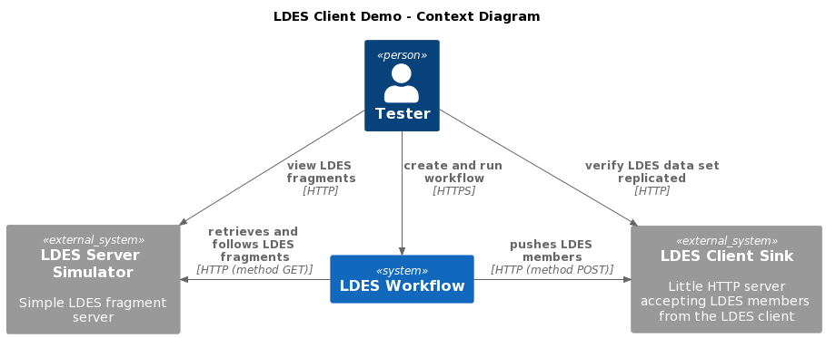
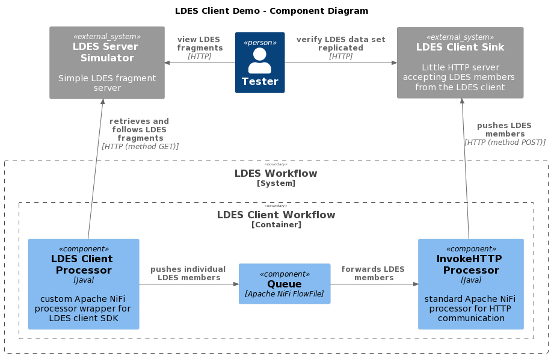

# LDES Client Can Replicate an LDES
The test verifies that the LDES Client can replicating a (small subset of the) GIPOD data set. It uses a context containing a (LDES Server) simulator serving the fragments, a workflow containing the LDES Client and a http sender and a message sink backed by a data store (mongodb).

The simulator (http://localhost:9011) is seeded by a subset of the GIPOD dataset containing five fragments of which the first four fragments contain 250 members each and the last one contains 16 members, making a total of 1016 LDES members served.

## Test Setup
> **Note**: if needed, copy the [environment file (.env)](./.env) to a personal file (e.g. `user.env`) and change the settings as needed. If you do, you need to add ` --env-file user.env` to each `docker compose` command.

Run all systems except the workflow by executing the following (bash) command:
```bash
docker compose up -d
```

## Test Execution
1. Seed the LDES Server Simulator with a part of the GIPOD data set and [alias it](./create-alias.json):
    ```bash
    for f in ../../data/parkAndRide/*; do curl -X POST "http://localhost:9011/ldes" -H "Content-Type: text/turtle" -d "@$f"; done
    curl -X POST "http://localhost:9011/alias" -H "Content-Type: application/json" -d '@data/create-alias.json'
    ```
    To verify that the [simulator](http://localhost:9011/) is correctly seeded you can run this command: 
    ```bash
    curl http://localhost:9011/
    ```

2. Start the workflow containing the LDES Client to run the replication using:
    ```bash
    docker compose up ldio-workbench -d
    while ! docker logs $(docker ps -q -f "name=ldio-workbench$") | grep 'Started Application in' ; do sleep 1; done
    ```
    or:
    ```bash
    docker compose up nifi-workbench -d
    while ! curl -s -I "http://localhost:8000/nifi/"; do sleep 5; done
    ```
    > **Note**: for the [NiFi workbench](http://localhost:8000/nifi/) you also need to upload the [workflow](./nifi-workflow.json) and start it

3. Verify LDES members are correctly received

    You can verify that, after some time, all (1016) LDES members are received by the sink HTTP server by visit the following pages: http://localhost:9003 (count) and http://localhost:9003/member (LDES member ids).

    Please run the following command repeatedly until it returns the correct member count:
    ```bash
    curl http://localhost:9003/
    ```

## Test Teardown
To stop all systems use:
```bash
docker compose rm -s -f -v ldio-workbench
docker compose --profile delay-started down
```
or:
```bash
docker compose rm -s -f -v nifi-workbench
docker compose --profile delay-started down
```

## C4 Diagrams

### Context


### Container


### Component

