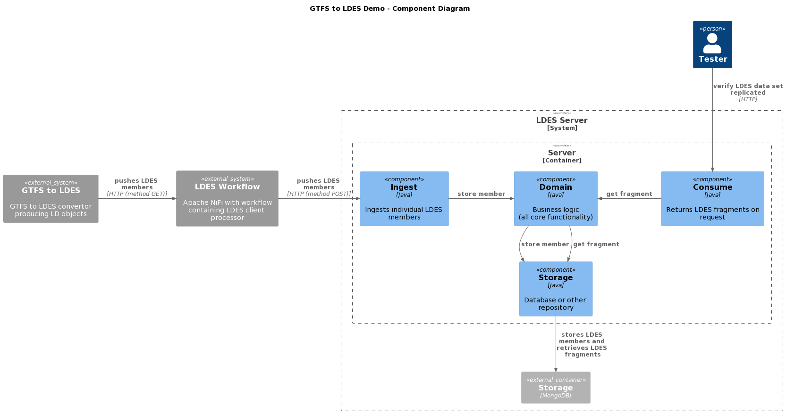

# LDES Server Can Ingest GTFS/RT
This scenario verifies that the LDES server can ingest GTFS (in addition to GIPOD mobility hindrances) and can keep in sync with the GTFS updates (GTFS/RT). It uses a context containing a [GTFS to LDES convertor (JavaScript variant)](https://github.com/julianrojas87/gtfs2ldes-js) generating GTFS and GTFS/RT linked connections (version objects), a workflow (for buffering) containing a http listener and a http sender and the LDES Server backed by a data store (mongodb).

## Test Setup
1. Run all systems except the GTFS to LDES convertor by executing the following (bash) command:
```bash
docker compose up -d
```
> **Notes**:
> * if needed, copy the [environment file (.env)](./.env) to a personal file (e.g. `user.env`) and change the settings as needed. If you do, you need to add ` --env-file user.env` to each `docker compose` command.
> * in the [data folder](./data/) you can find additional GTFS/RT source to test with (e.g. [De Lijn](./data/delijn.env) & [NMBS/SNCB](./data/nmbs.env))
> * for the [GTFS(RT) data from De Lijn](https://data.delijn.be/) you will need to request a subcription and then you will receive an API (authentication) key which is required to receive the realtime changes.
> * the GTFS2LDES service is assigned to an arbitrary profile named `delay-started` to prevent it from starting immediately.

Please ensure that the LDES Server is ready to ingest by following the container log until you see the following message `Cancelled mongock lock daemon`:
```bash
docker logs --tail 1000 -f $(docker ps -q --filter "name=ldes-server$")
```
Press `CTRL-C` to stop following the log.

> **Note**: as of server v1.0 which uses dynamic configuration you need to execute the [seed script](./config/seed.sh) to setup the LDES with its views:
```bash
chmod +x ./config/seed.sh
sh ./config/seed.sh
```

## Test Execution
1. Start the workbench:
    ```bash
    docker compose up ldio-workbench -d
    while ! docker logs $(docker ps -q -f "name=ldio-workbench$") | grep 'Started Application in' ; do sleep 1; done
    ```
    or:
    ```bash
    docker compose up nifi-workbench -d
    while ! curl -s -I "http://localhost:8000/nifi/"; do sleep 5; done
    ```
    > **Note**: for the [NiFi workbench](http://localhost:8000/nifi/) you also need to upload the [workflow](./nifi-workflow.json) and start it

2. Start the GTFS to LDES convertor:
    ```bash
    docker compose up gtfs2ldes-js -d
    ```
    and verify that the GTFS to LDES convertor is processing the GTFS or GTFS/RT source  by following the container log until you see the following message `Posted 100 Connection updates so far...`:
    ```bash
    docker logs --tail 1000 -f $(docker ps -q --filter "name=gtfs2ldes-js$")
    ```
    Press `CTRL-C` to stop following the log.

3. Verify LDES Members are being ingested (execute repeatedly):
    ```bash
    curl http://localhost:9019/bustang/ldesmember
    ```
    or request the collection:
    ```bash
    curl http://localhost:8080/connections/paged
    ```

## Test Teardown
To stop all systems use:
```bash
docker compose rm -s -f -v gtfs2ldes-js
docker compose rm -s -f -v ldio-workbench
docker compose down
```
or:
```bash
docker compose rm -s -f -v gtfs2ldes-js
docker compose rm -s -f -v nifi-workbench
docker compose down
```

## C4 Diagrams

### Context


### Container


### Component

