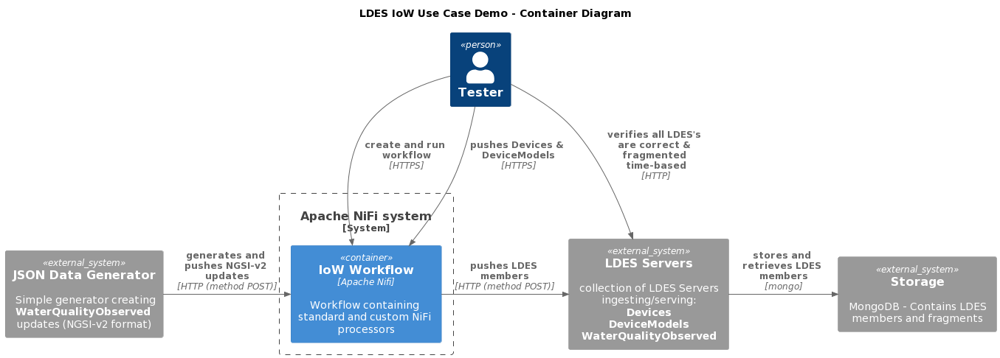
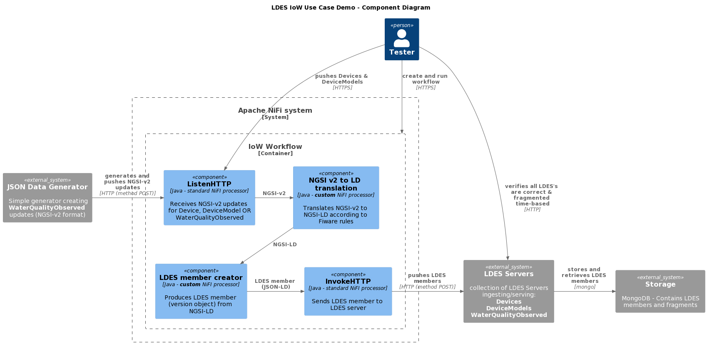

# Convert NGSI-v2 State Objects to NGSI-LD Version Objects
The test verifies that the (NiFi or LDIO) Workbench can convert IoW messages formatted as NGSI-v2 into NGSI-LD messages. It uses a [JSON Data Generator](https://github.com/Informatievlaanderen/VSDS-LDES-E2E-message-generator/README.md) which produces a continues stream of water-quality observations (as a controlled alternative to an actual Orion broker over which we have no control), an Apache NiFi or LDIO instance containing an HTTP listener that receives the observations (and devices & models), the components translating the NGSI-v2 entities to NGSI-LD entities, the components creating the LDES members (version objects) from the NGSI-LD entities and the LDES servers configured to capture the LDES members.

## Test Setup
> **Note**: if needed, copy the [environment file (.env)](./.env) to a personal file (e.g. `user.env`) and change the settings as needed. If you do, you need to add ` --env-file user.env` to each `docker compose` command.

1. Run all systems except the workflow by executing the following (bash) command:
    ```bash
    docker compose up -d
    ```
    Please ensure that the LDES Servers are ready to ingest by following the container logs until you see the following message `Cancelled mongock lock daemon`:
    ```bash
    docker logs --tail 1000 -f $(docker ps -q --filter "name=ldes-server$")
    ```
    Press `CTRL-C` to stop following each log.

   > **Note**: as of server v1.0 which uses dynamic configuration you need to execute the [seed script](./config/seed.sh) to setup the LDES with its views:
   ```bash
   chmod +x ./config/seed.sh
   sh ./config/seed.sh
   ```

2. Start the workflow containing the LDES Client
    ```bash
    docker compose up ldio-workbench -d
    while ! docker logs $(docker ps -q -f "name=ldio-workbench$") | grep 'Started Application in' ; do sleep 1; done
    ```
    or:
    ```bash
    docker compose up nifi-workbench -d
    while ! curl -s -I "http://localhost:8000/nifi/"; do sleep 5; done
    ```
    > **Note**: for the [NiFi workbench](http://localhost:8000/nifi/) you also need to upload the [workflow](./nifi-workflow.json) and start it. Finally, verify that the NiFi HTTP listeners are ready (they should answer `OK`):
    > ```bash
    > curl http://localhost:8081/healthcheck
    > ```

3. Verify that the empty LDES can be retrieved:
    ```bash
    curl http://localhost:8080/device-models/by-time
    curl http://localhost:8080/devices/by-time
    curl http://localhost:8080/water-quality-observations/by-time
    ```

## Test Execution
1. Upload the [device](./data/device.json) and [device model](./data/device-model.json) test files:
    ```bash
    curl -X POST http://localhost:8081/device-models-pipeline -H 'Content-Type: application/json' -d '@data/device-model.json' 
    curl -X POST http://localhost:8081/devices-pipeline -H 'Content-Type: application/json' -d '@data/device.json' 
     ```

2. Start the JSON Data Generator to start receiving `WaterQualityObserved` messages:
    ```bash
    docker compose up test-message-generator -d
    ```

3. Verify all LDES streams 

    The [models LDES server](http://localhost:8072/models/by-time)) and the [devices LDES server](http://localhost:8071/devices/by-time) should contain one member. The [observations LDES server](http://localhost:8073/observations/by-time) continues to grow as `WaterQualityObserved` LDES members are ingested and form an ever growing, time-based fragmented LDES stream:
    ```bash
     curl http://localhost:8080/device-models/by-time
     curl http://localhost:8080/devices/by-time
     curl http://localhost:8080/water-quality-observations/by-time
    ```

    > **Note**: The model type should be `https://uri.etsi.org/ngsi-ld/default-context/DeviceModel`, the device type should be `https://uri.etsi.org/ngsi-ld/default-context/Device` and the observation type should be `https://uri.etsi.org/ngsi-ld/default-context/WaterQualityObserved`.


## Test Teardown
If using NiFi, first [stop the workflow](../../_nifi-workbench/README.md#stop-a-workflow) and then to stop all systems use:
```bash
docker compose rm -s -f -v test-message-generator
docker compose rm -s -f -v ldio-workbench
docker compose down
```
or
```bash
docker compose rm -s -f -v test-message-generator
docker compose rm -s -f -v nifi-workbench
docker compose down
```

## C4 Diagrams

### Context


### Container


### Component

