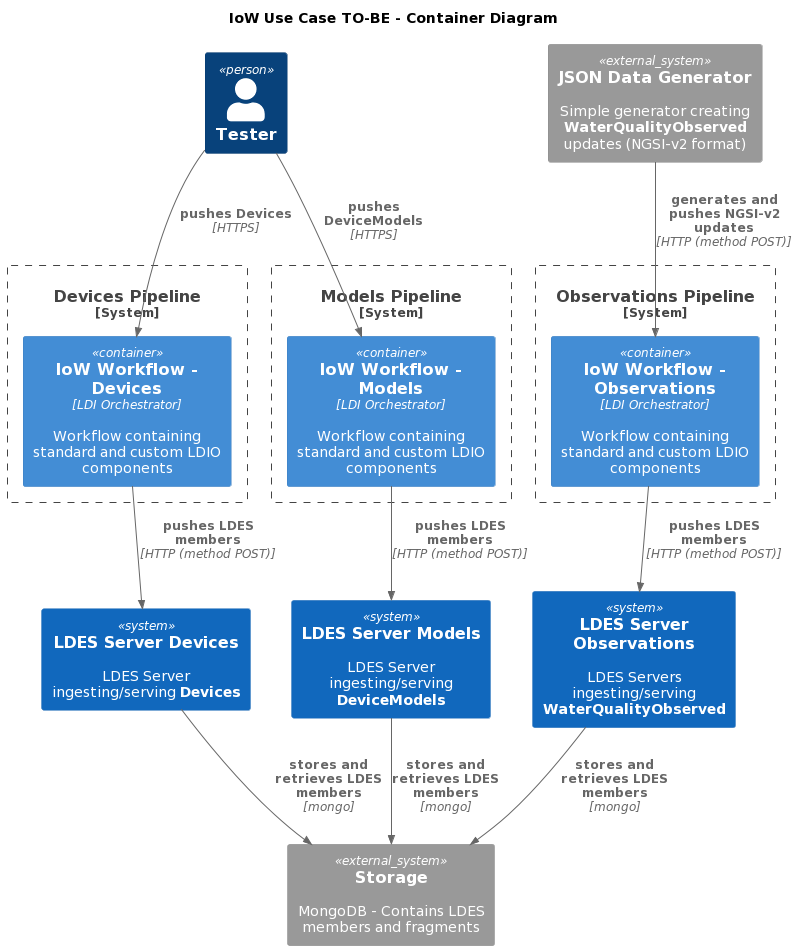
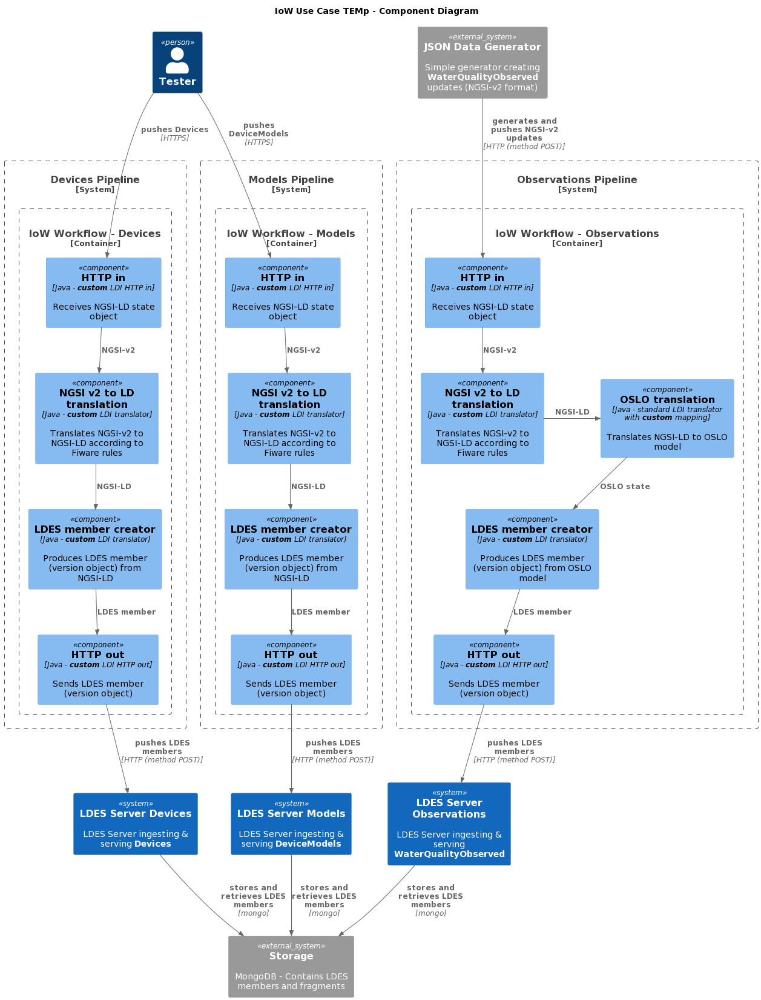

# Use New Framework to Convert Water Quality NGSI-v2 to NGSI-LD or OSLO Model - Part 2
This tests is the second and final step towards a setup which does not require the use of Apache NiFi to host the workflow which converts the incoming NGSI-v2 messages towards an OSLO model (or a NGSI-LD model if no corresponding OSLO model exists). The test is based on the [previous IoW test](../016.mixed-workbench-ngsi-v2-to-oslo/README.md).

This second step towards a NiFi-less approach executes the complete transformation pipline using the [new runner](https://github.com/Informatievlaanderen/VSDS-Linked-Data-Interactions). The result is then ingested in an LDES server.

> **Note**: that the steps and the results are identical to these from the [previous IoW test](../015.nifi-workbench-ngsi-v2-to-oslo/README.md).

## Test Setup
> **Note**: if needed, copy the [environment file (.env)](./.env) to a personal file (e.g. `user.env`) and change the settings as needed. If you do, you need to add ` --env-file user.env` to each `docker compose` command.

1. Run all systems except the workflow by executing the following (bash) command:
    ```bash
    docker compose up -d
    ```
   Please ensure that the LDES Server is ready to ingest by following the container log until you see the following message `Mongock has finished`:
    ```bash
    docker logs --tail 1000 -f $(docker ps -q --filter "name=ldes-server$")
    ```
   Press `CTRL-C` to stop following each log.

2. Verify that the empty LDES views can be retrieved:
    ```bash
    curl http://localhost:8080/device-models/by-time
    curl http://localhost:8080/devices/by-time
    curl http://localhost:8080/water-quality-observations/by-time
    ```

## Test Execution
1. Send test data by using the following commands:
    ```bash
    curl -X POST http://localhost:8081/device-models-pipeline -H 'Content-Type: application/json' -d '@data/model.json' 
    curl -X POST http://localhost:8081/devices-pipeline -H 'Content-Type: application/json' -d '@data/device.json' 
    ```
2. Start the JSON Data Generator to start receiving `WaterQualityObserved` messages:
    ```bash
    docker compose up test-message-generator -d
    ```

3. Verify all LDES streams

   To validate that the LDES'es contain the correct OSLO models, you can retrieve the LDES views and follow the relations.
     ```bash
     curl http://localhost:8080/device-models/by-time
     curl http://localhost:8080/devices/by-time
     curl http://localhost:8080/water-quality-observations/by-time
     ```

   > **Note**: that only the observations are converted to an OSLO model. The object type should be `ttp://www.w3.org/ns/sosa/ObservationCollection`. The model type and the device type should still be `https://uri.etsi.org/ngsi-ld/default-context/DeviceModel` respectively `https://uri.etsi.org/ngsi-ld/default-context/Device`.

## Test Teardown
First [stop the workflow](../../_nifi-workbench/README.md#stop-a-workflow) and then to stop all systems use:
```bash
docker compose rm -s -f -v test-message-generator
docker compose down
```

## C4 Diagrams

### Context


### Container


### Component

