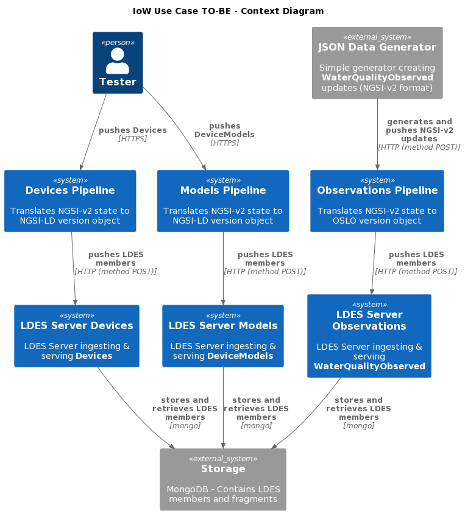

# Convert NGSI-v2 State Objects to OSLO Version Objects
This test verifies the convertion towards OSLO models, more specific, it demonstrates converting the [NGSI water quality model](https://github.com/smart-data-models/dataModel.WaterQuality) into its [OSLO model](https://data.vlaanderen.be/standaarden/kandidaat-standaard/vocabularium-en-applicatieprofiel-oslo-waterkwaliteit.html). The test uses a similar setup as the [NGSI-v2 to NGSI-LD conversion test](../014.workbench-ngsi-v2-to-ngsi-ld/README.md) but adds an additional component in the LDIO workflow to convert the NGSI-LD to the OSLO model. This conversion happens after converting the incoming NGSI-v2 model to the NGSI-LD model and before creating a version object and sending that to an LDES server.

The conversion from NGSI-LD to OSLO is a SPARQL construct conversion and is done using a custom LDIO component ([Sparql Construct](https://www.w3.org/TR/rdf-sparql-query/#construct) processor).

## Test Setup
> **Note**: if needed, copy the [environment file (.env)](./.env) to a personal file (e.g. `user.env`) and change the settings as needed. If you do, you need to add ` --env-file user.env` to each `docker compose` command.

1. Run all systems except the workflow by executing the following (bash) command:
    ```bash
    docker compose up -d
    ```
   Please ensure that the LDES Server is ready to ingest by following the container log until you see the following message `Cancelled mongock lock daemon`:
    ```bash
    docker logs --tail 1000 -f $(docker ps -q --filter "name=ldes-server$")
    ```
   Press `CTRL-C` to stop following each log.

   > **Note**: as of server v1.0 which uses dynamic configuration you need to execute the [seed script](./config/seed.sh) to setup the LDES with its views:
   ```bash
   chmod +x ./config/seed.sh
   sh ./config/seed.sh
   ```

2. Verify that the empty LDES views can be retrieved:
    ```bash
    curl http://localhost:8080/device-models/by-page
    curl http://localhost:8080/devices/by-page
    curl http://localhost:8080/water-quality-observations/by-page
    ```

## Test Execution
1. Send test data by using the following commands:
    ```bash
    curl -X POST http://localhost:8081/device-models-pipeline -H 'Content-Type: application/json' -d '@data/model.json' 
    curl -X POST http://localhost:8081/devices-pipeline -H 'Content-Type: application/json' -d '@data/device.json' 
    ```
2. Start the JSON Data Generator to start receiving `WaterQualityObserved` messages:
    ```bash
    docker compose up test-message-generator -d
    ```

3. Verify all LDES streams

   To validate that the LDES'es contain the correct OSLO models, you can retrieve the LDES views and follow the relations.
     ```bash
     curl http://localhost:8080/device-models/by-page
     curl http://localhost:8080/devices/by-page
     curl http://localhost:8080/water-quality-observations/by-page
     ```

   > **Note**: that only the observations are converted to an OSLO model. The object type should be `ttp://www.w3.org/ns/sosa/ObservationCollection`. The model type and the device type should still be `https://uri.etsi.org/ngsi-ld/default-context/DeviceModel` respectively `https://uri.etsi.org/ngsi-ld/default-context/Device`.

## Test Teardown
To stop all systems use:
```bash
docker compose rm -s -f -v test-message-generator
docker compose down
```

## C4 Diagrams

### Context


### Container


### Component

