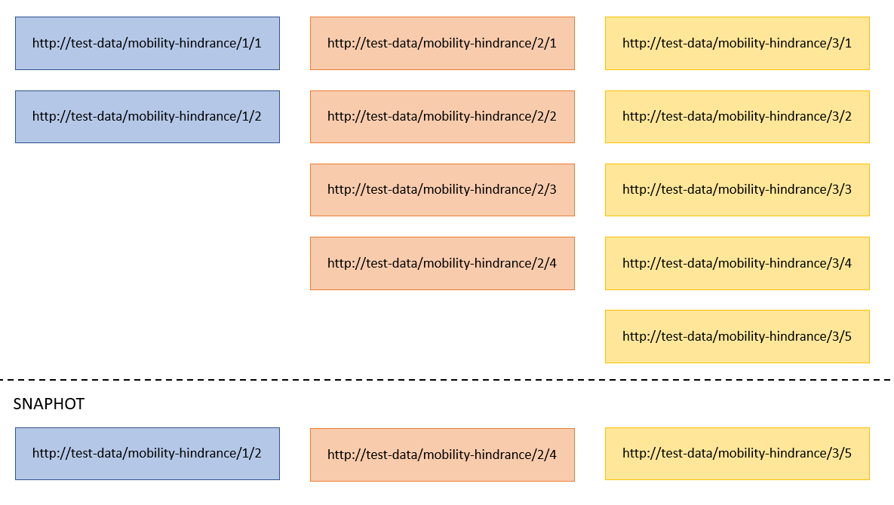
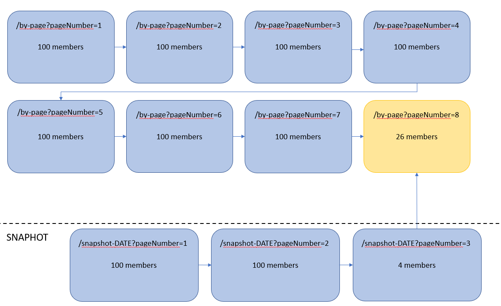

# LDES Server Can Create a Snapshot
This scenario verifies that the LDES server can create a snapshot. It uses a [custom context](./docker-compose.yml) containing an LDES Server backed by a data store (mongodb).

For this test you can use a [small dataset](./data/small/) or a [medium-sized dataset](./data/medium/).

## Scenario
```gherkin
Scenario: Create a snapshot using the LDES server
  Given An LDES server with the defaultView enabled
  And I have ingested a series of tree members
  When I create a snapshot via the admin api by making a post request on '/admin/api/v1/snapshots'
  Then the snapshot is created
  And the snapshot contains only the latest version of every resource
  And the snapshot has a relation to the mutable tree node of the default view
  And the snapshot is saved in the database
  And the snapshot can be retrieved as an LDES stream
```

```gherkin
Scenario: Create a snapshot using the LDES server based on a previous snapshot
  Given An LDES server with the defaultView enabled
  And The LDES server has created a snapshot
  And I have ingested a series of tree members
  When I create a snapshot via the admin api by making a post request on '/admin/api/v1/snapshots'
  Then the snapshot is created
  And the snapshot contains only the latest version of every resource
  And the snapshot has a relation to the mutable tree node of the default view
  And the snapshot is saved in the database
  And the snapshot can be retrieved as an LDES stream
```

### Small dataset
If you chose to use the small dataset then 11 members will be ingested in the server. These members are all version objects of three resources. A schematic overview of the members is given in the following figure:


When a snapshot is created only the latest version objects are kept in the snapshot and therefore it only contains three members:
* https://test-data/mobility-hindrance/1/2
* https://test-data/mobility-hindrance/2/4
* https://test-data/mobility-hindrance/3/5

As the dataset is relatively small the original steam only has one fragment. The snapshot will in this case have a link towards this mutable fragment.

### Medium dataset
The medium dataset consists of 726 version objects of 204 resources. When we create a snapshot of this dataset, only the latest version objects of the 204 resources will be in the snapshot. The last tree node of the snapshot will point towards the mutable tree node of the default view, in this case: `/by-page?pageNumber=8`.

A schematic overview is given below:


## Test Setup
1. Launch all systems:
    ```bash
    docker compose up -d
    ```
    Please ensure that the LDES Server is ready to ingest by following the container log until you see the following message `Cancelled mongock lock daemon`:
    ```bash
    docker logs --tail 1000 -f $(docker ps -q --filter "name=ldes-server$")
    ```
    Press `CTRL-C` to stop following the log.
    
    > **Note**: it may take a minute for the LDES Server to start.

2. Ingest the small data set:
    ```bash
    for member in {1..9}; do \
      curl -i -X POST \
        --url 'http://localhost:8080/mobility-hindrances' \
        -H "Content-Type: text/turtle" \
        --data-binary "@./data/small/member$member.ttl"
    done
    ```
    OR the medium-sized data set:
    ```bash
    for member in {1..720} ; do
      curl -i -X POST \
        --url 'http://localhost:8080/mobility-hindrances' \
        -H "Content-Type: text/turtle" \
        --data-binary "@./data/medium/member$member.ttl"
    done
    ```

3. Verify that the members exist in the LDES:
    ```bash
    curl http://localhost:8080/mobility-hindrances/by-page?pageNumber=1 -s | grep "terms:isVersionOf" | wc -l
    ```
    > **Note**: for the small data set this should be 9. For the medium-sized this returns 100 members, as do an additional 6 pages. The last page contains the final 20 members:
    ```bash
    curl http://localhost:8080/mobility-hindrances/by-page?pageNumber=8 -s | grep "terms:isVersionOf" | wc -l
    ```
    
4. Verify the fragment count:
   ```bash
   curl http://localhost:9019/test/ldesfragment?includeIds=true
   ```
   this returns:
   ```json
   {
      "count":2,
      "ids":[
        "/mobility-hindrances/by-page",
        "/mobility-hindrances/by-page?pageNumber=1"
      ]
   }
   ```
    > **Note**: for the small data set this should be two, i.e. 1 root fragment and 1 page fragment. For the medium-sized data set there are 9 fragments in total (the root fragment and the 8 page fragments).

## Test execution
1. Create a snapshot:
    ```bash
    curl -X POST http://localhost:8080/admin/api/v1/mobility-hindrances/snapshots
    ```

2. Verify that a new collection is created named `snapshot` containing 1 document:
   ```bash
   curl http://localhost:9019/test/snapshot?includeIds=true
   ```
   this returns something similar to:
   ```json
   {
    "count":1,
    "ids":["mobility-hindrances/snapshot-2023-04-07T12:52:23.931014032"]
   }
   ```

3. Verify the fragment count has increased:
   ```bash
   curl http://localhost:9019/test/ldesfragment?includeIds=true
   ```
   The collection `ldesfragment` now contains additional fragments which are part of the snapshot view, E.g. (for the medium-sized data set):
   ```json
    {
      "count":4,
      "ids":[
        "/mobility-hindrances/by-page",
        "/mobility-hindrances/by-page?pageNumber=1",
        "/mobility-hindrances/snapshot-2023-04-07T12:52:23.931014032",
        "/mobility-hindrances/snapshot-2023-04-07T12:52:23.931014032?pageNumber=1"
      ]
    }
    ```
   
4. Expand the dataset using the small dataset:
   ```bash
    for member in {10..11}; do \
      curl -i -X POST \
        --url 'http://localhost:8080/mobility-hindrances' \
        -H "Content-Type: text/turtle" \
        --data-binary "@./data/small/member$member.ttl"
    done
    ```

   OR using the medium dataset:
   ```bash
    for member in {721..726} ; do
      curl -i -X POST \
        --url 'http://localhost:8080/mobility-hindrances' \
        -H "Content-Type: text/turtle" \
        --data-binary "@./data/medium/member$member.ttl"
    done
    ```
   
5. Create a second snapshot:
    ```bash
    curl -X POST http://localhost:8080/admin/api/v1/mobility-hindrances/snapshots
    ```
   
6. Verify that a new collection is created like in step 2
   ```bash
   curl http://localhost:9019/test/snapshot?includeIds=true
   ```
   this returns something similar to:
   ```json
   {
    "count":2,
    "ids":["mobility-hindrances/snapshot-2023-04-07T12:52:23.931014032",
      "mobility-hindrances/snapshot-2023-04-07T12:52:25.752463851"]
   }
   ```

7. Verify the fragment count has increased like in step 3:
   ```bash
   curl http://localhost:9019/test/ldesfragment?includeIds=true
   ```
   For the medium dataset:
   Note that even though only a couple of members were added, atleast 2 non-root fragments were created to contain the latest versions of the 204 resources.
    ```json
    {
      "count":6,
      "ids":[
        "/mobility-hindrances/by-page",
        "/mobility-hindrances/by-page?pageNumber=1",
        "/mobility-hindrances/snapshot-2023-04-07T12:52:23.931014032",
        "/mobility-hindrances/snapshot-2023-04-07T12:52:23.931014032?pageNumber=1",
        "/mobility-hindrances/snapshot-2023-04-07T12:52:25.752463851",
        "/mobility-hindrances/snapshot-2023-04-07T12:52:25.752463851?pageNumber=1"
      ]
    }
    ```

## Test teardown
Bring all systems down:
```bash
docker compose down
```
