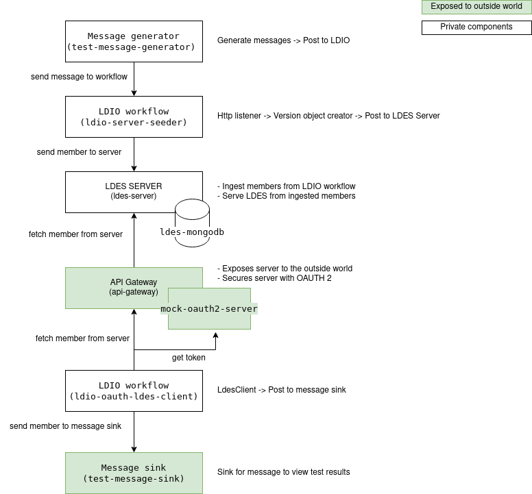

# LDES Client can consume an OAUTH 2 protected endpoint using client-credentials
The test verifies that the LDES Client can consume data from an OAUTH 2 protected server.
It uses the following setup:



The message generator creates messages and sends these to an LDIO workflow.
This workflow creates version objects and seeds the LDES server.
The LDES server cannot be reached from outside the docker network but is exposed through and API Gateway
which is set up using NGINX and a mock OAUTH2 server.
A second LDIO workflow with an OAUTH2 enabled LDES Client is used to consume the server and write the messages
to a message sink to verify the LDES Client supports the OAUTH2 Client Credentials flow.

## Test Setup
> **Note**: if needed, copy the [environment file (.env)](./.env) to a personal file (e.g. `user.env`) and change the settings as needed. If you do, you need to add ` --env-file user.env` to each `docker compose` command.

Run all systems except the workflow by executing the following (bash) command:
```bash
docker compose up -d
```
Please ensure that the LDES Server is ready to ingest by following the container log until you see the following message `Cancelled mongock lock daemon`:
```bash
docker logs --tail 1000 -f $(docker ps -q --filter "name=ldes-server$")
```
Press `CTRL-C` to stop following the log.

> **Note**: as of server v1.0 which uses dynamic configuration you need to execute the [seed script](./config/seed.sh) to setup the LDES with its views:
```bash
chmod +x ./config/seed.sh
sh ./config/seed.sh
```

## Test Execution

1. Seed the LDES Server by starting the message generator:
   ```bash
   docker compose up test-message-generator -d
   ```

2. Start the workflow with the LDES client:
   ```bash
   docker compose up ldio-workbench -d
   while ! docker logs $(docker ps -q -f "name=ldio-workbench$") | grep 'Started Application in' ; do sleep 1; done
   ```
   or:
   ```bash
   docker compose up nifi-workbench -d
   while ! curl -s -I "http://localhost:8000/nifi/"; do sleep 5; done
   ```
   > **Note**: for the [NiFi workbench](http://localhost:8000/nifi/) you also need to upload the [workflow](./nifi-workflow.json) and start it

3. Verify LDES members are correctly received in the message sink
   ```bash
   curl http://localhost:9003
   ```
Please run the previous command repeatedly until the member count increases. The LDES Client checks the fragments 
for updates every 60 seconds. The count will increase in bursts of this interval.

   > **Note**: there are more alternatives to verify the member count in the database. See [notes](#notes) below.

4. Verify that the api gateway returns forbidden when it is called without correction authorization
    ```bash
    curl http://localhost:8080/devices
    ```
   The above call should return 403 - forbidden.

## Test Teardown
To stop all systems use:
```bash
docker compose rm -s -f -v ldio-workbench
docker compose down
```
or:
```bash
docker compose rm -s -f -v nifi-workbench
docker compose down
```

## Notes
To verify the member count, alternatively use the [Mongo Compass](https://www.mongodb.com/products/compass) tool and verifying that the `gipod.ldesmember` document collection contains all the LDES members (check the document count).
