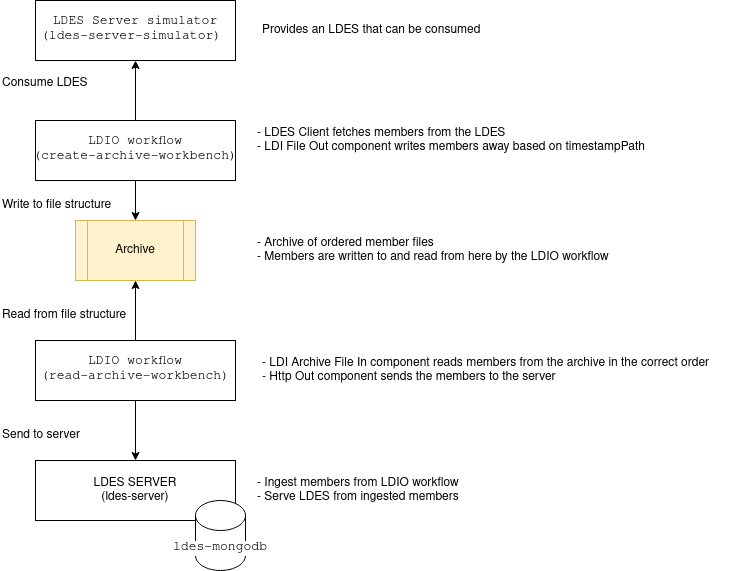

# The LDES workbench can be used to archive the LDES Server

This test verifies:
- A file archive can be created from an LDES on the server using the workbench.
- A server can be seeded from a file archive using the workbench.



The Ldes server simulator serves an LDES based on a small subset of the GIPOD data set.
The 'create-archive-workbench' has an LDES Client that consumes the LDES server and uses the archive file out component to write the members to a file archive.
The 'read-archive-workbench' has an archive file in component to consume the archive and post the members to the server using the Http out component.

## Test Setup
> **Note**: if needed, copy the [environment file (.env)](./.env) to a personal file (e.g. `user.env`) and change the settings as needed. If you do, you need to add ` --env-file user.env` to each `docker compose` command.

Run all systems except the workflow by executing the following (bash) command:
```bash
docker compose up -d
```

## Test Execution

1. Seed the LDES Server Simulator with a part of the GIPOD data set and [alias it](./create-alias.json):
    ```bash
    for f in ../../data/gipod/*; do curl -X POST "http://localhost:9011/ldes" -H "Content-Type: application/ld+json" -d "@$f"; done
    curl -X POST "http://localhost:9011/alias" -H "Content-Type: application/json" -d '@data/create-alias.json'
    ```
   To verify that the [simulator](http://localhost:9011/) is correctly seeded you can run this command:
    ```bash
    curl http://localhost:9011/
    ```

2. Archive the members from the simulator by starting the archiving workflow
   ```bash
   docker compose up ldio-create-archive -d
   while ! docker logs $(docker ps -q -f "name=ldio-create-archive$") | grep 'Started Application in' ; do sleep 1; done
   ```
   or:
   ```bash
   docker compose up nifi-workbench -d
   while ! curl -s -I "http://localhost:8000/nifi/"; do sleep 5; done
   ```
   With nifi you also need to upload the [workflow](./nifi-create-archive-workflow.json) and start it

3. Verify the archive in directory 'archive'
   You should see a new directory structure:
      - 2022
        - 4
          - 19
          - 20
          - ...
        - 5
          - 2
          - 3
          - ...

    These directories represent year/month/day. The days contain the actual members that have been archived in the 
    following format: `2022-04-29-09-32-30-080000000.nq`
    
    These timestamps are extracted from the members by the time-stamp-path that we provide to the archive component.
    Duplicate timestamps are resolved by adding a sequence suffix: `2022-04-29-09-32-30-080000000-1.nq`

4. Start a new LDES Server
   ```bash
   docker compose up ldes-server -d
   ```
   Please ensure that the LDES Server is ready to ingest by following the container log until you see the following message `Cancelled mongock lock daemon`:
   ```bash
   docker logs --tail 1000 -f $(docker ps -q --filter "name=ldes-server$")
   ```
   Press `CTRL-C` to stop following the log.
   
   > **Note**: as of server v1.0 which uses dynamic configuration you need to execute the [seed script](./config/seed.sh) to setup the LDES with its views:
   ```bash
   chmod +x ./config/seed.sh
   sh ./config/seed.sh
   ```
5. Verify LDES Server is empty
    ```bash
    curl http://localhost:9019/gipod/ldesmember
    ```    

    Should return `{"count":0}`

6. Restore the archive
   ```bash
   docker compose up ldio-read-archive -d
   while ! docker logs $(docker ps -q -f "name=read-archive$") | grep 'Started Application in' ; do sleep 1; done
   ```
   or:
   Upload the [workflow](./nifi-read-archive-workflow.json) and start it.

7. Verify server
    ```bash
    curl http://localhost:9019/gipod/ldesmember
    ```    

   Should eventually return `{"count":1016}`

## Test Teardown
To stop all systems use:
```bash
docker compose rm -s -f -v ldio-create-archive
docker compose rm -s -f -v ldio-read-archive
docker compose rm -s -f -v ldes-server
docker compose down
```
or:
```bash
docker compose rm -s -f -v nifi-workbench
docker compose rm -s -f -v ldes-server
docker compose down
```

And clean up the archive directory:
   Linux and Mac
   ```bash
   sudo rm -rf ./archive/2022
   ```
   Windows
   ```bash
   rm -rf ./archive/2022
   mkdir ./archive
   ```
