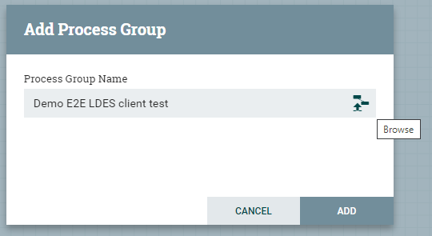
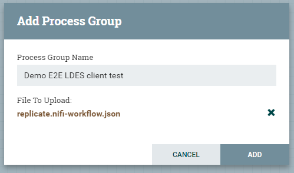
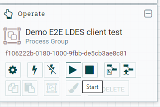

# Apache NiFi Workbench
The Apache NiFi system is a workbench capable of running workflows containing NiFi processors.

## Logon to Apache NiFi
In order to logon, point your favorite browser to http://localhost:8000/nifi/login.

## Create a Workflow
In order to create a workflow based on a predefined workflow definition, you need to:
* drag-n-drop the process group icon on the NiFi workpace:

* enter the process group name, browse to the pre-defined workflow definition, select it and confirm the add action

 

* verify that the workflow is added, open it by double-clicking its title bar and verify the workflow contents

  

## Start a Workflow
To launch a workflow, ensure that no processor is selected (click in the workpace OR navigate back to the root process group and select the newly added process group) and click the start button.

 

## Stop a Workflow
To stop a workflow, ensure that no processor is selected (click in the workpace OR navigate back to the root process group and select the newly added process group) and click the stop button (immediately to the right of the start button).
