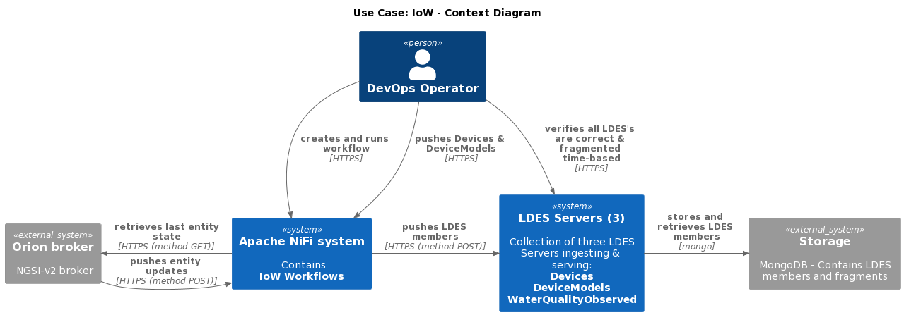
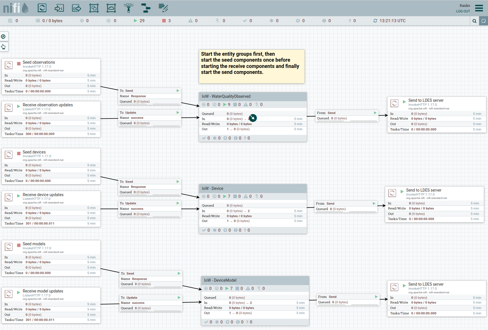

# Use Case: IoW
For the Internet of Water (IoW) use case, the current architecture exposes water quality observations and related entities as [NGSI-v2](https://fiware-tutorials.readthedocs.io/en/stable/getting-started/) through an [Orion broker](https://fiware-orion.readthedocs.io/en/master/).

To receive the current state of the entities of interest, including the last observations (the initial data set), the Orion broker can be [queried](https://fiware-ges.github.io/orion/archive/api/v2/cookbook/) using HTTP(S) calls. To receive updates for these entities, a [subscription](https://fiware.github.io/specifications/ngsiv2/stable/) must be created which ensures the Orion broker sends HTTP(S) messages to an endpoint of choice.

To use this data set in an LDES (Linked Data Event Stream) environment, the data received as response from querying the initial data set and the subsequent messages received as result of the subscriptions, is converted to a linked data equivalent model using an [Apache NiFi](https://nifi.apache.org/) workflow. The received NGSI-v2 data is first convert to a NGSI-LD equivalent model ([Smart Data Model for water quality](https://github.com/smart-data-models/dataModel.WaterQuality)) and then to the [OSLO equivalent model](https://data.vlaanderen.be/doc/applicatieprofiel/waterkwaliteit). Finally, the resulting model, which is a entity state, is used to create an LDES member, which is a version object.

## Architecture
In the IoW use case we deploy one [Apache NiFi system](https://localhost:8443/nifi) to convert the NGSI-v2 data into LDES member, three individual LDES Servers to ingest and serve the observations, devices and device models and one MongoDB to store the ingested data and LDES fragments. Here is a context diagram of those systems:

As an example we provide a [Docker Compose](./docker-compose.yml) file containing the above systems and an [environment](./.env) file containing the most relevant environment variables that can be tuned. Alternatively, if needed, you can change or extend the compose file and the environment file for your need.

## Workflow(s)
To ingest the water quality observations and related models (device and device model) we use one Apache NiFi [workflow](./workflow.json) consisting of 3 almost identical flows. Each flow allows to seed the initial data set, that is, request and handle the current state of observations, devices and models. In addition, each flow contains a listener that captures the messages sent from the Orion broker because of a subscription. Here is an example of the observations flow:

### Seeding the Initial Data Set
To retrieve the initial data set, each flow uses a default `InvokeHTTP` processor to query an Orion broker of your choice protected by an `X-API-KEY` (found in an Apache NiFi parameter context named `IOW`):
* parameter `iow-orion`: base path of the Orion broker to query for the initial data set (e.g. `https://api.example.org/my-orion`)
* parameter `iow-api-key`: X-API-KEY for querying the Orion broker

The response received is split into individual entities for processing (`Split entities`).

If you do not need seeding, you can remove the `Seed entities` (InvokeHTTP) and `Split entities` (SplitJson) processors from the flows.

In order to actually seed the initial data set, run the `Seed entities` processor once (right-click processor and choose `Run Once`) and start the `Split entities` (select processor and choose `Start`).

### Listening for Entity Updates
The `Receive updates` workflow listeners are by default configured here:
* devices: http://localhost:9012 (the Orion broker should POST device update messages here) - check if running at: http://localhost:9012/healthcheck
* models: http://localhost:9013 (typically, no updates are posted for models) - check if running at: http://localhost:9013/healthcheck
* observations: http://localhost:9014 (the Orion broker should POST observation update messages here) - check if running at: http://localhost:9014/healthcheck

The `Extract data` (SplitJson) processor extracts the entity from the update message received from the Orion broker.

To start receiving updates start both processors.

### Converting the Entities to LDES Members
To convert the received entities (both initial state or update), the NGSI-v2 formatted entity is converted to NGSI-LD using a [custom processor](https://github.com/Informatievlaanderen/VSDS-LDESWorkbench-NiFi/tree/main/ngsiv2-to-ngsi-ld-processor), the NGSI-LD is then converted to its OSLO equivalent model using a standard JSON-to-JSON processor (JoltTransformJSON) and a custom specification (e.g. [transform for observations](../../e2e-test/use-cases/iow/4.oslo-model-using-jolt/data/transforms/wqo.jolt-transform.json)) and finally to an LDES member (version object creation) using [another custom processor](https://github.com/Informatievlaanderen/VSDS-LDESWorkbench-NiFi/tree/main/ngsi-ld-to-ldes-processor).

You can tune each of these processors to your needs, see [here](https://github.com/Informatievlaanderen/VSDS-LDESWorkbench-NiFi) and the [Apache NiFi documentation](https://nifi.apache.org/docs.html).

To convert the received entities start these processors.

### Ingesting the LDES Members
To ingest the observation, device and device model LDES members we use a standard InvokeHTTP processor to POST to the configured endpoints. By default, these endpoints are configured to send the LDES members to the LDES Server Docker containers (by using their internal names). Please tune as needed.

To send the LDES members to the LDES server, start the processor.

After a very brief moment you can request the LDES'es:
* LDES: http://localhost:8073/water-quality-observations, view: http://localhost:8073/water-quality-observations/by-time
* LDES: http://localhost:8072/device-models, view: http://localhost:8072/device-models/by-time
* LDES: http://localhost:8071/devices, view: http://localhost:8071/devices/by-time

## More information
If you need more info on the above systems or configuration please find here the repositories and Docker images:
* custom [Apache NiFi system](https://github.com/Informatievlaanderen/VSDS-LDESWorkbench-NiFi) (including all our custom processors) and the custom [Docker images](https://github.com/Informatievlaanderen/VSDS-LDESWorkbench-NiFi/pkgs/container/ldes-workbench-nifi)
* [LDES Server](https://github.com/Informatievlaanderen/VSDS-LDESServer4J) and [Docker images](https://github.com/Informatievlaanderen/VSDS-LDESServer4J/pkgs/container/ldes-server) - when configuring an LDES Server in a Docker container, you need to capitalize the configuration parameters, use underscores in between words and possibly indexes, see the Docker compose file for examples

To consume the LDES'es, you can use the [LDES Client](https://github.com/Informatievlaanderen/VSDS-LDESWorkbench-NiFi/tree/main/ldes-client-processor) which is also included in our custom Apache NiFi system. It allows to follow (replicate and synchronize) an LDES in a Apache NiFi context. Alternatively you can use the Command Line Interface (CLI) or the Software Development Kit (SDK):
* [LDES Client CLI](https://github.com/Informatievlaanderen/VSDS-LDESClientCli) and [Docker images](https://github.com/Informatievlaanderen/VSDS-LDESClientCli/pkgs/container/ldes-cli)
* [LDES CLient SDK - Java](https://github.com/Informatievlaanderen/VSDS-LDESClient4J)
